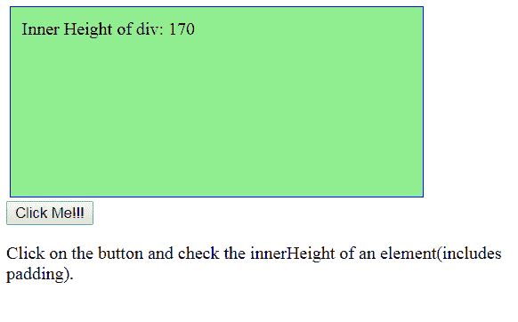

# jQuery | height()和 innerHeight()示例

> 原文:[https://www . geeksforgeeks . org/jquery-height-and-inner height-with-examples/](https://www.geeksforgeeks.org/jquery-height-and-innerheight-with-examples/)

**height()** 是 jQuery 中的一个内置方法，用于检查元素的高度，但不会检查元素的填充、边框和边距。
**语法:**

```html
$("param").height()

```

**参数:**本功能不接受任何参数。
**返回值:**返回所选元素的高度。

<center>**jQuery code to show the working of the height() function**</center>

**Code #1:**

```html
<html>

<head>
    <script src="https://ajax.googleapis.com/ajax/libs/
                 jquery/3.3.1/jquery.min.js"></script>
    <script>
        $(document).ready(function() {
            $("button").click(function() {
                var msg = "";
                msg += "height of div: " + $("#demo").height();
                $("#demo").html(msg);
            });
        });
    </script>
    <style>
        #demo {
            height: 150px;
            width: 350px;
            padding: 10px;
            margin: 3px;
            border: 1px solid blue;
            background-color: lightgreen;
        }
    </style>
</head>

<body>
    <div id="demo"></div>
    <button>Click Me!!!</button>
    <p>Click on the button and check the height of the
       element(excluding padding).</p>
</body>

</html>
```

**输出:**
点击【点击我】按钮前-

点击【点击我】按钮后-


**jQuery** 还包括 **innerHeight()** 方法，即用于检查包含填充的元素的内部高度。
**语法:**

```html
$("param").innerHeight()

```

**参数:**本功能不接受任何参数。
**返回值:**返回所选元素的内部高度。
**代码#2:**

```html
<html>

<head>
    <script src="https://ajax.googleapis.com/ajax/libs/
                 jquery/3.3.1/jquery.min.js"></script>
    <script>
        $(document).ready(function() {
            $("button").click(function() {
                var msg = "";
                msg += "Inner Height of div: " + $("#demo").
                        innerHeight() + "</br>";
                $("#demo").html(msg);
            });
        });
    </script>
</head>
<style>
    #demo {
        height: 150px;
        width: 350px;
        padding: 10px;
        margin: 3px;
        border: 1px solid blue;
        background-color: lightgreen;
    }
</style>

<body>
    <div id="demo"></div>
    <button>Click Me!!!</button>
    <p>Click on the button and check the innerHeight of
       an element(includes padding).</p>
</body>

</html>
```

**输出:**
点击【点击我】按钮前-

点击【点击我】按钮后-
