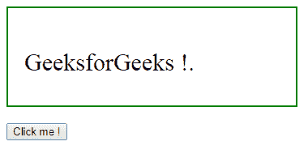
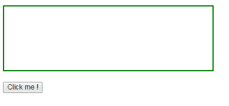
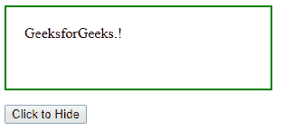
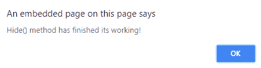

# jQuery | hide()带示例

> 原文:[https://www.geeksforgeeks.org/jquery-hide-with-examples/](https://www.geeksforgeeks.org/jquery-hide-with-examples/)

**hide()** 是 jQuery 中用于隐藏所选元素的内置方法。
**语法:**

```html
$(selector).hide(duration, easing, call_function);

```

这里选择器是被选择的元素。
**参数:**接受以下指定的三个参数-

*   **持续时间:**指定隐藏效果的速度。
*   **缓和:**指定元素在动画不同点的速度。
*   **call_function:** 这是隐藏操作后要执行的回调函数。

**返回值:**不返回值。

<center>**jQuery 代码显示 hide()方法的工作方式:**</center>

**代码#1:**
在下面的代码中，没有参数用于传递给这个方法。

```html
<html>

<head>
    <script src="https://ajax.googleapis.com/ajax/libs/jquery/3.3.1/jquery.min.js">
    </script>
    <!-- jQuery code to show the working of this method -->
    <script>
        $(document).ready(function() {
            $(".b1").click(function() {
                $("p").hide();
            });
        });
    </script>
    <style>
        div {
            width: 50%;
            height: 80px;
            padding: 20px;
            margin: 10px;
            border: 2px solid green;
            font-size: 30px;
        }

        .b1 {
            margin: 10px;
        }
    </style>
</head>

<body>
    <div>
        <p>GeeksforGeeks !.</p>
    </div>
    <!-- click on this button and above paragraph will disappear -->
    <button class="b1">Click me !</button>

</body>

</html>
```

**输出:**
点击“点击我！”
按钮-

点击“点击我！”按钮-


**代码#2:**
在下面的代码中，参数被传递给这个方法。

```html
<html>

<head>
    <script 
    src="https://ajax.googleapis.com/ajax/libs/jquery/3.3.1/jquery.min.js">
    </script>
    <script>
        <!-- jQuery code to show the working of this method -->
        $(document).ready(function() {
            $(".btn1").click(function() {
                $("p").hide(1000, function() {
                    alert("Hide() method has finished its working!");
                });
            });
        });
    </script>
    <style>
        p {
            width: 40%;
            padding: 20px;
            height: 50px;
            border: 2px solid green;
        }
    </style>
</head>

<body>

    <p>GeeksforGeeks.!</p>
    <!-- click on this button and above paragraph will hide -->
    <button class="btn1">Click to Hide</button>

</body>

</html>
```

**输出:**
之前点击【点击隐藏】按钮-


点击【点击隐藏】按钮后-
