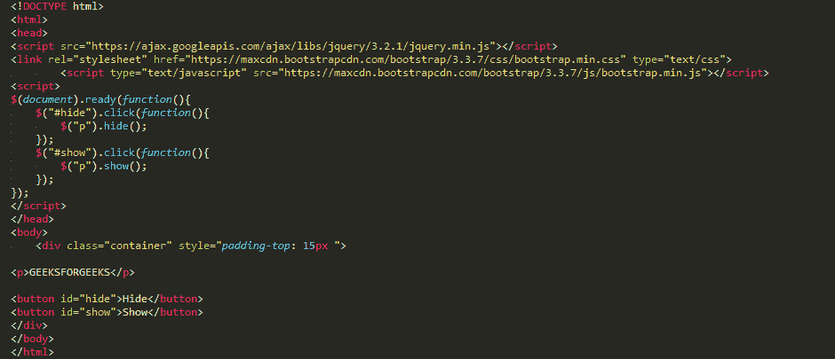

# jQuery |隐藏/显示、切换和淡入淡出方法示例

> 原文:[https://www . geesforgeks . org/jquery-hidesshow-toggle-fading-methods-examples/](https://www.geeksforgeeks.org/jquery-hideshow-toggle-fading-methods-examples/)

jQuery 提供了一个非常简单的界面来实现各种惊人的效果。jQuery 方法允许我们用最少的配置快速应用常用的效果。

**jQuery hide()和 show()**

*   **jQuery hide() :** 隐藏要隐藏的语法或 html 元素。

    ```
    $(selector).hide(speed, callback);
    ```

*   **jQuery show() :** 显示您希望用户看到的语法或 html 元素。

    ```
    $(selector).show(speed, callback);
    ```

对于上述两种语法，速度参数是一个可选参数，用于定义隐藏和显示 html 内容的速度。可以使用预定义字符串“慢速”或“快速”中的一个来指定持续时间，或者以毫秒为单位来指定持续时间，以获得更高的精度；较高的值表示较慢的动画。
回调参数是隐藏和显示功能完成后使用的可选参数。

**示例:**
hide()方法只是设置内嵌样式显示:？所选元素无。相反，show()方法将匹配的元素集的显示属性恢复到内联样式显示之前的初始状态，通常是块、内联或内联块:？没有一个适用于他们。
**输出:**

<video class="wp-video-shortcode" id="video-199634-1" width="490" height="196" preload="metadata" controls=""><source type="video/webm" src="https://media.geeksforgeeks.org/wp-content/uploads/1.webm?_=1">[https://media.geeksforgeeks.org/wp-content/uploads/1.webm](https://media.geeksforgeeks.org/wp-content/uploads/1.webm)</video>
**Examples of Speed Parameter :**
**Example 1 :**
**Output :**<video class="wp-video-shortcode" id="video-199634-2" width="490" height="196" preload="metadata" controls=""><source type="video/webm" src="https://media.geeksforgeeks.org/wp-content/uploads/2.webm?_=2">[https://media.geeksforgeeks.org/wp-content/uploads/2.webm](https://media.geeksforgeeks.org/wp-content/uploads/2.webm)</video>
**Example 2:**
**Output :**<video class="wp-video-shortcode" id="video-199634-3" width="490" height="196" preload="metadata" controls=""><source type="video/webm" src="https://media.geeksforgeeks.org/wp-content/uploads/3.webm?_=3">[https://media.geeksforgeeks.org/wp-content/uploads/3.webm](https://media.geeksforgeeks.org/wp-content/uploads/3.webm)</video>

**jQuery toggle()**

jQuery toggle()方法以这样一种方式显示或隐藏元素:如果元素最初被显示，它将被隐藏；如果隐藏，它将被显示。

**语法:**

```
$(selector).toggle(speed, callback);
```

速度和回调参数是与前一个相同的可选参数。
**例:** 
**输出:**

<video class="wp-video-shortcode" id="video-199634-4" width="490" height="196" preload="metadata" controls=""><source type="video/webm" src="https://media.geeksforgeeks.org/wp-content/uploads/4.webm?_=4">[https://media.geeksforgeeks.org/wp-content/uploads/4.webm](https://media.geeksforgeeks.org/wp-content/uploads/4.webm)</video>

**jQuery 淡入淡出方法**

在 jQuery 的帮助下，您可以根据需要淡入或淡出 HTML 元素。
以下是淡入淡出的方法:

1.  **jQuery fadeIn() Method :**
    **Syntax :**

    ```
    $(selector).fadeIn(speed, callback);
    ```

    **fadeIn()** 功能用于在 HTML 中显示一个隐藏的元素。可选参数“速度”用于控制隐藏元素的速度，第二个可选参数在淡入淡出完成后使用。
    **例:** 
    **输出:**

    <video class="wp-video-shortcode" id="video-199634-5" width="336" height="288" preload="metadata" controls=""><source type="video/webm" src="https://media.geeksforgeeks.org/wp-content/uploads/6.webm?_=5">[https://media.geeksforgeeks.org/wp-content/uploads/6.webm](https://media.geeksforgeeks.org/wp-content/uploads/6.webm)</video>
2.  **jQuery fadeOut() Method :**
    **Syntax :**

    ```
    $(selector).fadeOut(speed, callback);
    ```

    **淡出()**功能用于淡出(隐藏)HTML 中的一个元素。可选参数“速度”用于控制查看元素的速度，第二个可选参数在淡出完成后使用。
    **例:** 
    **输出:**

    <video class="wp-video-shortcode" id="video-199634-6" width="336" height="288" preload="metadata" controls=""><source type="video/webm" src="https://media.geeksforgeeks.org/wp-content/uploads/7.webm?_=6">[https://media.geeksforgeeks.org/wp-content/uploads/7.webm](https://media.geeksforgeeks.org/wp-content/uploads/7.webm)</video>
3.  **jQuery fadeToggle() Method :**
    **Syntax :**

    ```
    $(selector).fadeToggle(speed, callback);
    ```

    **fadeToggle()** 功能用于在 **fadeIn()** 和 **fadeOut**
    **之间切换示例:** 
    **输出:**

    <video class="wp-video-shortcode" id="video-199634-7" width="336" height="288" preload="metadata" controls=""><source type="video/webm" src="https://media.geeksforgeeks.org/wp-content/uploads/8.webm?_=7">[https://media.geeksforgeeks.org/wp-content/uploads/8.webm](https://media.geeksforgeeks.org/wp-content/uploads/8.webm)</video>
4.  **jQuery fadeTo() Method :**
    **Syntax :**

    ```
    $(selector).fadeTo(speed, opacity, callback);
    ```

    **fadeTo()** 功能允许将元素淡化到给定的不透明度(0 到 1 之间的范围)，这是填充该功能的必需字段。可选参数“速度”用于控制隐藏元素的速度，第二个可选参数在淡入淡出完成后使用。
    **例:** 
    **输出:**

    <video class="wp-video-shortcode" id="video-199634-8" width="336" height="288" preload="metadata" controls=""><source type="video/webm" src="https://media.geeksforgeeks.org/wp-content/uploads/81.webm?_=8">[https://media.geeksforgeeks.org/wp-content/uploads/81.webm](https://media.geeksforgeeks.org/wp-content/uploads/81.webm)</video>