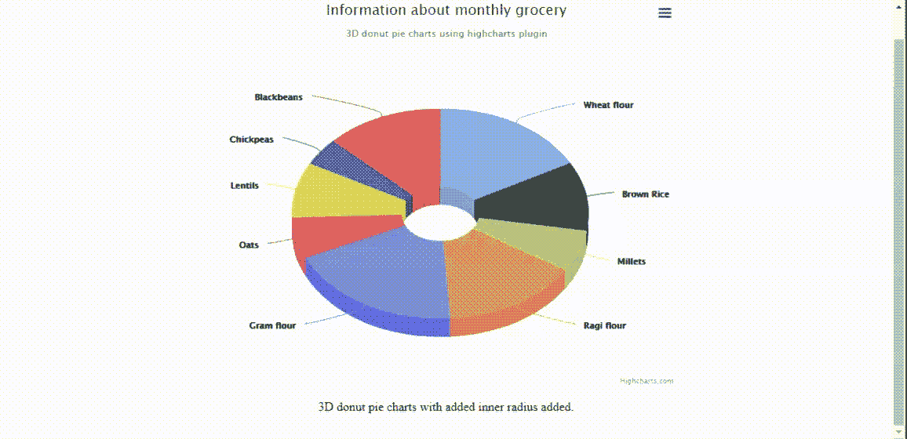

# jQuery Highcharts 插件

> 哎哎哎::1230【https://www . geeksforgeeks . org/jquery-high chart 插件/

jQuery 为程序员提供了一个非常现代和高度交互的 **Highcharts** 插件，以实现用于表示或比较网络和移动应用程序数据的图表。它是多平台的，支持 SVG。

您必须在工作文件夹中下载所需的文件，以便程序员可以在 HTML 结构页面的标题部分中包含以下程序中实现的内容。

**下载链接:**

> https://www.highcharts.com/blog/download/

**示例 1:** 以下示例使用**高级图表**插件演示了不同州及其人口的水平条形图。

```html
<!DOCTYPE HTML>
<html>
    <head>
        <meta http-equiv="Content-Type" 
              content="text/html; charset=utf-8">
        <meta name="viewport" 
              content="width=device-width, initial-scale=1">
        <title>jQuery Highcharts Plugin</title>

        <script src="highcharts.js"></script>
        <script src="exporting.js"></script>
        <script src="export-data.js"></script>
        <script src="accessibility.js"></script>

        <style type="text/css">

        body{
         text-align:center;
        }

        .highcharts-data-table table, highcharts-figure{
            min-width: 310px; 
            max-width: 650px;
            margin: 2em auto;
        }

        #containerDivID{
            height: 450px;
        }

        .highcharts-data-table table {
            font-family: Arial;    
            border: 2px solid #e9e9e9;
            margin: 10px auto;
            text-align: center;
            max-width: 500px;
            width: 90%;

        }
        .highcharts-data-table caption {
            padding: 1em 0;
            font-size: 1.1em;
            color: #FFFF;
        }
        .highcharts-data-table tr:hover {
            background: #bedaff;
        }
        .highcharts-data-table th {
            font-weight: 600;
            padding: 0.5em;
        }
        .highcharts-data-table td, 
        .highcharts-data-table th, 
        .highcharts-data-table caption {
            padding: 0.6em;
        }
        .highcharts-data-table thead tr, 
        .highcharts-data-table tr:nth-child(even) {
            background: #f8f8f8;
        }

        </style>
    </head>
    <body>
      <h1 style="color:green">GeeksforGeeks</h1>
      <b>jQuery Highcharts Plugin</b>
        <figure class="highcharts-figure">
            <div id="containerDivID"></div>
            <p class="highcharts-description">
               Column bar charts showing population
               data for various states in India.
            </p>

        </figure>

        <script type="text/javascript">

            Highcharts.chart('containerDivID', {
                chart: {
                    type: 'bar'
                },
                title: {
                    text: 'India Population by states'
                },

                xAxis: {
                    categories: ['Karnataka', 'Telangana', 
                                 'Punjab', 'Assam', 'Orissa'],

                },
                yAxis: {
                    min: 0,
                    title: {
                        text: 'Population (lakhs)',
                        align: 'high'
                    },             
                },
                tooltip: {
                    valueSuffix: 'lakhs'
                },
                plotOptions: {
                    bar: {
                        dataLabels: {
                            enabled: true
                        }
                    }
                },
                legend: {
                    layout: 'vertical',
                    align: 'right',
                    verticalAlign: 'top',
                    x: -50,
                    y: 100,       
                    borderWidth: 5,
                    backgroundColor: Highcharts.defaultOptions
                         .legend.backgroundColor || '#FFFFFF',

                },
                credits: {
                    enabled: false
                },
                series: [{
                    name: 'Year 2000',
                    data: [1107, 231, 6351, 4203, 2329]
                }, {
                    name: 'Year 2005',
                    data: [1233, 1526, 1947, 1408, 1261]
                }, {
                    name: 'Year 2010',
                    data: [1814, 8641, 3714, 4727, 2191]
                }, {
                    name: 'Year 2015',
                    data: [1276, 1301, 4436, 6238, 2247]
                }]
            });
        </script>
    </body>
</html>
```

**输出:**


**示例 2:** 以下示例演示了通过使用**高级图表**插件，单个用户在特定年份访问各种网站的 3D 饼图。

```html
<!DOCTYPE HTML>
<html>
    <head>
        <meta http-equiv="Content-Type" 
              content="text/html; charset=utf-8">
        <meta name="viewport" 
              content="width=device-width, initial-scale=1">
        <title>jQuery Highcharts Plugin</title>

        <script src="highcharts.js"></script>
                <script src="highcharts-3d.js"></script>
                <script src="exporting.js"></script>
                <script src="export-data.js"></script>
                <script src="accessibility.js"></script>

        <style type="text/css">

            body{
              text-align: center;
            }        
            #containerDivID 
            {
              height: 500px; 
            }

            .highcharts-figure, 
            .highcharts-data-table table 
            {
              min-width: 310px; 
              max-width: 600px;
              margin: 2em auto;
            }

            .highcharts-data-table table
            {
              font-family: Arial;
              border-collapse: collapse;
              border: 2px solid #e9e9e9;
              margin: 10px auto;
              text-align: center;
              width: 90%;
              max-width: 550px;
            }
            .highcharts-data-table td, 
            .highcharts-data-table th, 
            .highcharts-data-table caption 
            {
              padding: 0.6em;
            }
            .highcharts-data-table caption 
            {
              padding: 2em 0;
              font-size: 1.3em;
              color: #FFFF;
            }
            .highcharts-data-table th 
            {
              font-weight: 600;
              padding: 0.5em;
            }
            .highcharts-data-table tr:hover
            {
              background: #f8f8f8;
            }
            .highcharts-data-table thead tr, 
            .highcharts-data-table tr:nth-child(even)
            {
              background: #ffffff;
            }

           </style>
    </head>
    <body>
        <h1 style="color:green">
              GeeksforGeeks
        </h1>
        <b>jQuery Highcharts Plugin</b>

        <figure class="highcharts-figure">
            <div id="containerDivID"></div>
            <p class="highcharts-description">        
                This demonstrates the usage of 3D pie chart.
                Select or de-select any portion from the 
                chart for information.       
            </p>  
        </figure>

        <script type="text/javascript">

                Highcharts.chart('containerDivID', {
                    chart: {
                        type: 'pie',
                        options3d: {
                            enabled: true,
                            alpha: 45,
                            beta: 0
                        }
                    },
                    title: {
                        text: 'Websites accessed in 2020'
                    },
                    accessibility: {
                        point: {
                            valueSuffix: '%'
                        }
                    },
                    tooltip: {
                        pointFormat: '{series.name}: {point.percentage:.1f}%'
                    },
                    plotOptions: {
                        pie: {
                            allowPointSelect: true,
                            cursor: 'pointer',
                            depth: 30,
                            dataLabels: {
                                enabled: true,
                                format: '{point.name}'
                            }
                        }
                    },
                    series: [{
                        type: 'pie',
                        name: 'Website used',
                        data: [
                            ['GeeksforGeeks', 55.0],
                            ['NDTV', 27.5],           
                            ['youTube', 9.5],
                            ['google', 7.2],
                            ['Others', 1.5]
                        ]
                    }]
                });
        </script>
    </body>
</html>
```

**输出:**


**示例 3:** 通过对 jQuery 代码进行如下简单更改，可以类似地实现上述示例来表示 3D 圆环饼图。输出图表如下图所示。

```html
<script type="text/javascript">

        Highcharts.chart('containerDivID', {
            chart: {
                type: 'pie',
                options3d: {
                    enabled: true,
                    alpha: 45
                }
            },
            title: {
                text: 'Information about monthly grocery'
            },
            subtitle: {
                text: '3D donut pie charts'+
                      ' using highcharts plugin'
            },
            plotOptions: {
                pie: {
                    innerSize: 100,
                    depth: 45
                }
            },
            series: [{
                name: 'Delivered amount in kgs',
                data: [
                    ['Wheat flour', 8],
                    ['Brown Rice', 5],
                    ['Millets', 3],
                    ['Ragi flour', 7],
                    ['Gram flour', 9],
                    ['Oats', 3],
                    ['Lentils', 4],
                    ['Chickpeas', 2],
                    ['Blackbeans', 6]
                ]
            }]
        });
 </script>
```

**输出:**


所有使用**高图表**插件实现的图表都可以扩展到**高图表表**插件。通过使用高图表库，有一种方法可以将 HTML 表格数据转换成所需的图表。

[下载](https://github.com/highchartTable/jquery-highchartTable-plugin)链接，除了**高图**插件的文件之外，还包括头部所需的文件。

**示例 4:** 以下示例演示了非常基本的**高图表表**插件用法，显示每月费用的柱形图。

```html
<!DOCTYPE html>
<html>
    <head>
        <title>jQuery HighchartTable Plugin</title>
        <meta charset="UTF-8">

        <script  src=
"https://cdnjs.cloudflare.com/ajax/libs/jquery/1.11.3/jquery.min.js">
        </script>
        <script src="highcharts.js"></script>  
        <script src="jquery.highchartTable.js"></script>
        <style>
            body 
            {
               font-family: Arial;
               text-align:center;
            }
            #containerDivID{
              width:550px;
              height:auto;
            }
        </style>
    </head>
    <body>
        <h1 style="color:green">GeeksforGeeks</h1>
        <b>jQuery HighchartTable Plugin</b>
        <div class="containerDivID">
            <table class="highchart" 
                   data-graph-container-before="1" 
                   data-graph-type="column">
                <thead>
                    <tr>
                        <th>Month</th>
                        <th>Expenditure</th>
                    </tr>
                </thead>
                <tbody>
                    <tr>
                        <td>January</td>
                        <td>18000</td>
                    </tr>
                    <tr>
                        <td>February</td>
                        <td>15000</td>
                    </tr>
                    <tr>
                        <td>March</td>
                        <td>13000</td>
                    </tr>
                    <tr>
                        <td>April</td>
                        <td>22000</td>
                    </tr>
                    <tr>
                       <td>May</td>
                       <td>12000</td>
                    </tr>
                    <tr>
                       <td>June</td>
                       <td>12000</td>
                    </tr>
                </tbody>
            </table>           
        </div>

        <script>
           $(document).ready(function() {
              $('table.highchart').highchartTable();
           });

        </script>
    </body>
</html>
```

**输出:**


**示例 5:** 以下示例使用**高图表表格**插件演示折线图。

```html
<!DOCTYPE html>
<html>
    <head>
        <title>jQuery HighchartTable Plugin</title>
        <meta charset="UTF-8" />

        <script src=
"https://cdnjs.cloudflare.com/ajax/libs/jquery/1.11.3/jquery.min.js">
        </script>
        <script src="highcharts.js"></script>
        <script src="jquery.highchartTable.js"></script>
        <style>
            body {
                font-family: Arial;
                text-align: center;
            }
            #containerDivID {
                width: 550px;
                height: auto;
            }
        </style>
    </head>
    <body>
        <h1 style="color: green;">
          GeeksforGeeks
        </h1>
        <b>jQuery HighchartTable Plugin</b>
        <div class="containerDivID">
            <table class="highchart" 
                   data-graph-container-before="1"
                   data-graph-type="line" 
                   data-graph-height="310px" 
                   data-graph-width="500px">
                <caption>
                    This shows line graph for 
                    monthly expense
                </caption>
                <thead>
                    <tr>
                        <th>Month</th>
                        <th>Expenditure</th>
                    </tr>
                </thead>
                <tbody>
                    <tr>
                        <td>January</td>
                        <td>18000</td>
                    </tr>
                    <tr>
                        <td>February</td>
                        <td>15000</td>
                    </tr>
                    <tr>
                        <td>March</td>
                        <td>13000</td>
                    </tr>
                    <tr>
                        <td>April</td>
                        <td>22000</td>
                    </tr>
                    <tr>
                        <td>May</td>
                        <td>12000</td>
                    </tr>
                </tbody>
            </table>
        </div>
        <script>
            $(document).ready(function () {
                $("table.highchart").highchartTable();
            });
        </script>
    </body>
</html>
```

**输出:**


**示例 6:** 以下示例使用**高级图表**插件演示气泡图，该插件表示三维数据。气泡图通常以 x 值、y 值和 z(大小)值绘制图形。水平 x 和垂直 y 是数值轴，z 代表其大小。

```html
<!DOCTYPE html>
<html>
<head>
    <meta http-equiv="Content-Type"
          content="text/html; charset=utf-8" />
    <meta name="viewport"
          content="width=device-width, initial-scale=1" />
    <title>jQuery Highcharts Plugin</title>

    <script src="highcharts.js"></script>
    <script src="highcharts-more.js"></script>
    <script src="exporting.js"></script>
    <script src="export-data.js"></script>
    <script src="accessibility.js"></script>

    <style type="text/css">
        body {
            text-align: center;
        }
        .highcharts-figure,
        .highcharts-data-table table {
            min-width: 310px;
            max-width: 600px;
            margin: 2em auto;
        }

        #containerDivID {
            height: 500px;
        }

        .highcharts-data-table table {
            font-family: Arial;
            border-collapse: collapse;
            border: 2px solid #e9e9e9;
            margin: 10px auto;
            text-align: center;
            width: 90%;
            max-width: 550px;
        }
        .highcharts-data-table caption {
            padding: 2em 0;
            font-size: 1.3em;
            color: #ffff;
        }
        .highcharts-data-table th {
            font-weight: 600;
            padding: 0.5em;
        }
        .highcharts-data-table td,
        .highcharts-data-table th,
        .highcharts-data-table caption {
            padding: 0.5em;
        }
        .highcharts-data-table thead tr,
        .highcharts-data-table tr:nth-child(even) {
            background: #f8f8f8;
        }
        .highcharts-data-table tr:hover {
            background: #ffffff;
        }
    </style>
</head>
<body>
    <h1 style="color: green;">GeeksforGeeks</h1>
    <b>jQuery Highcharts Plugin</b>

    <figure class="highcharts-figure">
        <div id="containerDivID"></div>
        <p class="highcharts-description">
            Bubble chart showing total products with their 
            sales achieved and market shares in percentage.
        </p>
    </figure>

    <script type="text/javascript">
        Highcharts.chart("containerDivID", {
            chart: {
                type: "bubble",
                plotBorderWidth: 1,
                zoomType: "xy",
            },

            legend: {
                enabled: false,
            },

            title: {
                text: "Sales and market share of"+
                      " products in the market",
            },

            accessibility: {
             point: {
                 valueDescriptionFormat: "{index}. {point.name}, "+
                                         "Product count: {point.x}, "+
                                         "Sales: Rs.{point.y}, "+
                                         "Market share: {point.z}%.",
             },
            },
            xAxis: {
                gridLineWidth: 1,
                title: {
                    text: "Total number of products sold",
                },
                labels: {
                    format: "{value} ",
                },
                plotLines: [
                    {
                        color: "black",
                        dashStyle: "dot",
                        width: 2,
                        value: 25,
                        label: {
                            rotation: 0,
                            y: 15,
                            style: {
                                fontStyle: "arial",
                            },
                            text: "Good number of products sold",
                        },
                        zIndex: 3,
                    },
                ],
                accessibility: {
                    rangeDescription: "Range: 20 to 30 numbers.",
                },
            },

            yAxis: {
                startOnTick: false,
                endOnTick: false,
                title: {
                    text: "Sales achieved",
                },
                labels: {
                    format: "Rs.{value} ",
                },
                maxPadding: 0.2,
                plotLines: [
                    {
                        color: "black",
                        dashStyle: "dot",
                        width: 2,
                        value: 50,
                        label: {
                            align: "right",
                            style: {
                                fontStyle: "arial",
                            },
                            text: "Good number for products sold",
                            x: -10,
                        },
                        zIndex: 3,
                    },
                ],
                accessibility: {
                    rangeDescription: "Range: 0 to 60, 000 rupees.",
                },
            },

            tooltip: {
                useHTML: true,
                headerFormat: "<table>",
                pointFormat:
                    '<tr><th colspan="2">{point.product}</th></tr>' +
                    "<tr><th>Products sold:</th><td>{point.x}</td></tr>" +
                    "<tr><th>Sales achieved :</th><td>Rs.{point.y}</td></tr>" +
                    "<tr><th>Market share:</th><td>{point.z}%</td></tr>",
                footerFormat: "</table>",
                followPointer: true,
            },

            plotOptions: {
                series: {
                    dataLabels: {
                        enabled: true,
                        format: "{point.name}",
                    },
                },
            },

            series: [
            {
                data: [
                    { x: 16, y: 5900, z: 3, name: "LB", product: "Ladies Bag" },
                    { x: 14, y: 22340, z: 14.7, name: "Sh", product: "Shoes" },
                    { x: 20, y: 60000, z: 15.8, name: "Mbl", product: "Mobile" },
                    { x: 18, y: 23500, z: 12, name: "Bks", product: "Books" },
                    { x: 22, y: 32200, z: 42, name: "SK", product: "Saving kit" },
                    { x: 31, y: 55000, z: 35, name: "Cp", product: "Cooking pans" },
                    { x: 17, y: 46000, z: 40, name: "MK", product: "Makeup kit" },
                    { x: 37, y: 19000, z: 10, name: "Pi", product: "Piano" },
                ],
            },
            ],
        });
    </script>
</body>
</html>
```

**输出:**


**示例 7:** 以下示例演示了使用**高级图表**插件的面积图。这些类似于前面演示的折线图，不同之处在于将数据可视化为体积。

```html
<!DOCTYPE html>
<html>
<head>
    <meta http-equiv="Content-Type" 
          content="text/html; charset=utf-8" />
    <meta name="viewport" 
          content="width=device-width, initial-scale=1" />
    <title>Highcharts Example</title>

    <script src="highcharts.js"></script>
    <script src="exporting.js"></script>
    <script src="export-data.js"></script>
    <script src="accessibility.js"></script>

    <style type="text/css">
        body {
            text-align: center;
        }
        .highcharts-figure,
        .highcharts-data-table table {
            min-width: 310px;
            max-width: 600px;
            margin: 2em auto;
        }

        #containerDivID {
            height: 500px;
        }

        .highcharts-data-table table {
            font-family: Arial;
            border-collapse: collapse;
            border: 2px solid #e9e9e9;
            margin: 10px auto;
            text-align: center;
            width: 90%;
            max-width: 550px;
        }
        .highcharts-data-table caption {
            padding: 2em 0;
            font-size: 1.3em;
            color: #ffff;
        }
        .highcharts-data-table th {
            font-weight: 600;
            padding: 0.5em;
        }
        .highcharts-data-table td,
        .highcharts-data-table th,
        .highcharts-data-table caption {
            padding: 0.5em;
        }
        .highcharts-data-table thead tr,
        .highcharts-data-table tr:nth-child(even) {
            background: #f8f8f8;
        }
        .highcharts-data-table tr:hover {
            background: #ffffff;
        }
    </style>
</head>
<body>
    <h1 style="color: green;">GeeksforGeeks</h1>
    <b>jQuery Highcharts Plugin</b>

    <figure class="highcharts-figure">
        <div id="containerDivID"></div>
        <p class="highcharts-description">
            It demonstrates the basic area chart
            showing men and women working strength .
        </p>
    </figure>

    <script type="text/javascript">
        Highcharts.chart("containerDivID", {
            chart: {
                type: "area",
            },
            accessibility: {
                description: "Image description: An area chart compares"+
                             " the working strength of the men and women"+
                             " between 1950 and 2020\. The number men or "+
                             " women are plotted on the Y-axis and the "+
                             " years on the X-axis. ",
            },
            title: {
                text: "Men and Women work force",
            },

            xAxis: {
                allowDecimals: false,
                labels: {
                    formatter: function () {
                        return this.value;
                    },
                },
                accessibility: {
                 rangeDescription: "Years between : 1950 to 2020.",
                },
            },
            yAxis: {
                title: {
                    text: "Working strength",
                },
                labels: {
                    formatter: function () {
                        return this.value / 1000 + "k";
                    },
                },
            },
            tooltip: {
             pointFormat: "{series.name} reached {point.y:, .0f}"+
                          " in numbers in year {point.x}",
            },
            plotOptions: {
                area: {
                    pointStart: 1950,
                    marker: {
                        enabled: false,
                        symbol: "circle",
                        radius: 2,
                        states: {
                            hover: {
                                enabled: true,
                            },
                        },
                    },
                },
            },
            series: [
                {
                    name: "men",
                    data: [
                        null,
                        null,
                        17,
                        12,
                        17,
                        13,
                        21,
                        14,
                        16,
                        19,
                        32,
                        21,
                        35,
                        25,
                        25,
                        55,
                        125,
                        155,
                        215,
                        427,
                        655,
                        852,
                        1160,
                        1617,
                        1478,
                        1321,
                        2138,
                        4221,
                        4512,
                        4502,
                        4502,
                        4500,
                        4501,
                        5502,
                        6229,
                        7189,
                        8139,
                        9199,
                        10538,
                        18517,
                        12527,
                        10475,
                        11421,
                        10358,
                        10295,
                        10104,
                        12610,
                        12401,
                        11643,
                        13092,
                        14478,
                        15915,
                        17385,
                        19055,
                        21215,
                        23210,
                        22010,
                        23044,
                        25393,
                        27935,
                        21000,
                        26000,
                        29000,
                        28010,
                        29020,
                        27010,
                        25000,
                        24000,
                        31982,
                        32040,
                        31233,
                        39197,
                        45000,
                    ],
                },
                {
                    name: "women",
                    data: [
                        null,
                        null,
                        11,
                        12,
                        22,
                        23,
                        24,
                        27,
                        28,
                        32,
                        27,
                        45,
                        67,
                        78,
                        86,
                        92,
                        112,
                        201,
                        250,
                        289,
                        369,
                        621,
                        1005,
                        1436,
                        2063,
                        3057,
                        4618,
                        5113,
                        5113,
                        4954,
                        4804,
                        4761,
                        4717,
                        4368,
                        4218,
                        6444,
                        9914,
                        9620,
                        9326,
                        9822,
                        15468,
                        18020,
                        17020,
                        16020,
                        15507,
                        14062,
                        12787,
                        13287,
                        14747,
                        13076,
                        12551,
                        12144,
                        11009,
                        10950,
                        10871,
                        11004,
                        14304,
                        23464,
                        24314,
                        23086,
                        22380,
                        21434,
                        24126,
                        27387,
                        29459,
                        31056,
                        29224,
                        27342,
                        26662,
                        26926,
                        27912,
                        28909,
                        28905,
                        27826,
                        25079,
                        25702,
                        24826,
                        24605,
                        30062,
                        32049,
                        33852,
                        35804,
                        37000,
                        35020,
                        33011,
                        31008,
                        37431,
                        43000,
                        41000,
                        39000,
                    ],
                },
            ],
        });
    </script>
</body>
</html>
```

**输出:**


插件中有更多漂亮的图表类型。程序员可以根据应用程序的需求进行探索和实现。