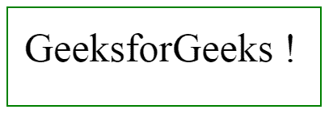
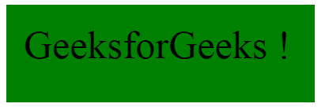
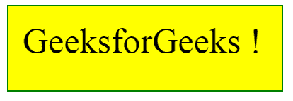

# jQuery |悬停()带示例

> 原文:[https://www.geeksforgeeks.org/jquery-hover-with-examples/](https://www.geeksforgeeks.org/jquery-hover-with-examples/)

**悬停()**是 jQuery 中的一个内置方法，用于指定当鼠标指针移动到所选元素上时启动的两个功能。
**语法:**

```
$(selector).hover(Function_in, Function_out);

```

这里选择器是被选择的元素。
**参数:**接受以下指定的两个参数-

*   **Function_in:** 指定鼠标进入事件发生时要运行的功能。
*   **Function_out:** 可选，指定鼠标离开事件发生时要运行的功能。

**返回值:**返回选中元素的背景色效果。

<center>**jQuery 代码显示悬停()的工作方式:**</center>

**代码#1:**

```
<html>

<head>
    <script src=
"https://ajax.googleapis.com/ajax/libs/jquery/3.3.1/jquery.min.js">
    </script>
    <script>
        <!-- jQuery code to show the working of hover() method -->
        $(document).ready(function() {
            $("p").hover(function() {
                $(this).css("background-color", "green");
            }, function() {
                $(this).css("background-color", "yellow");
            });
        });
    </script>
    <style>
        p {
            width: 55%;
            height: 80px;
            padding: 20px;
            margin: 10px;
            border: 2px solid green;
            font-size: 50px;
        }
    </style>
</head>

<body>
    <!--move the mouse in and out over this paragraph
        and background color will change-->
    <p>GeeksforGeeks !</p>

</body>

</html>
```

**输出:**
鼠标指针移至段落上之前-

鼠标指针移至段落上之后-

鼠标指针移出段落之后-
