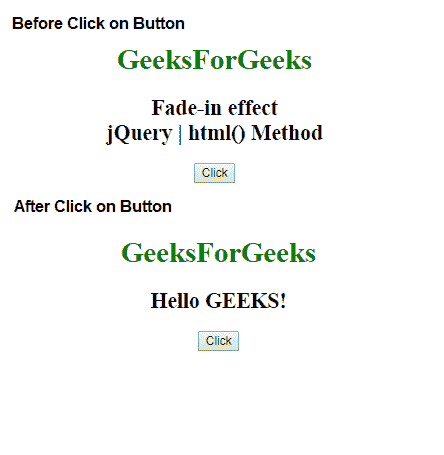
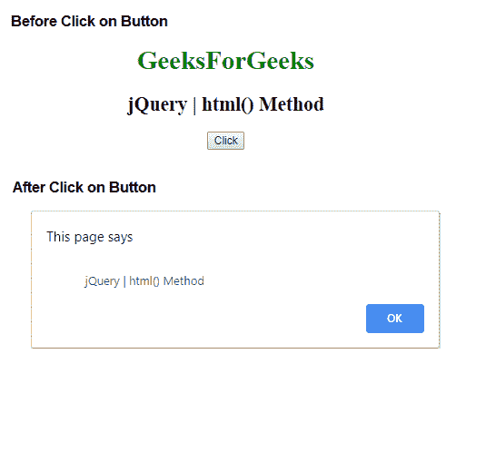
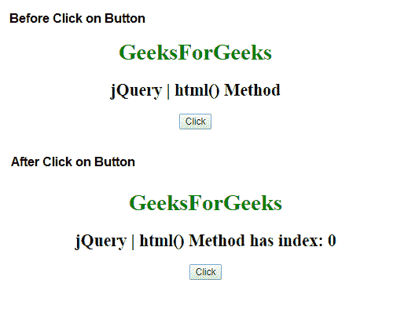

# jQuery | html()方法

> 原文:[https://www.geeksforgeeks.org/jquery-html-method/](https://www.geeksforgeeks.org/jquery-html-method/)

jQuery 中的 **html()方法**用于设置或返回选中元素的 innerHTML 内容。

**语法:**

*   它返回第一个匹配元素的内容。

    ```html
    $(selector).html()
    ```

*   它设置匹配元素的内容。

    ```html
    $(selector).html(content)
    ```

*   它设置内容使用功能。

    ```html
    $(selector).html(function(index, currentcontent))
    ```

**参数:**该方法接受两个参数，如上所述，如下所述:

*   **内容:**是为所选元素指定新内容的强制参数。
*   **函数(index，currentcontent):** 它是一个可选参数，用于指定返回所选元素新内容的函数。
    *   **索引:**用于返回元素在集合中的索引位置。
    *   **currentcontent:** 用于返回当前选中元素的 HTML 内容。

下面的例子说明了 jQuery 中的 html()方法:

**示例 1:** 本示例将内容设置为元素。

```html
<!DOCTYPE html>
<html>

<head> 
    <title>
        jQuery html() Method
    </title>

    <script src=
"https://ajax.googleapis.com/ajax/libs/jquery/3.3.1/jquery.min.js">
    </script>
</head> 

<body style = "text-align:center;">  

    <h1 style = "color:green;" >  
        GeeksForGeeks
    </h1>  

    <h2>
        Fade-in effect<br>
        jQuery | html() Method
    </h2>

    <button>Click</button>

    <script>
        $(document).ready(function(){
            $("button").click(function(){
                $("h2").html("Hello <b>GEEKS!</b>");
            });
        });
    </script>
</body>  

</html>
```

**输出:**


**示例 2:** 本示例返回元素的第一个匹配项。

```html
<!DOCTYPE html>
<html>

<head> 
    <title>
        jQuery html() Method
    </title>

    <script src=
"https://ajax.googleapis.com/ajax/libs/jquery/3.3.1/jquery.min.js">
    </script>
</head> 

<body style = "text-align:center;">  

    <h1 style = "color:green;" >  
        GeeksForGeeks
    </h1>  

    <h2>
        jQuery | html() Method
    </h2>

    <button>Click</button>

    <script>
        $(document).ready(function(){
            $("button").click(function(){
                alert($("h2").html());
            });
        });
    </script>
</body>  

</html>
```

**输出:**


**示例 3:** 本示例使用功能设置内容。

```html
<!DOCTYPE html>
<html>

<head> 
    <title>
        jQuery html() Method
    </title>

    <script src=
"https://ajax.googleapis.com/ajax/libs/jquery/3.3.1/jquery.min.js">
    </script>
</head> 

<body style = "text-align:center;">  

    <h1 style = "color:green;" >  
        GeeksForGeeks
    </h1>  

    <h2>
        jQuery | html() Method
    </h2>

    <button>Click</button>

    <!-- Script to set the content -->
    <script>
        $(document).ready(function() {
            $("button").click(function() {
                $("h2").html(function(n) {
                    return "jQuery | html() Method"
                            + " has index: " + n;
                });
            });
        });
    </script>
</body>  
</html>
```

**输出:**
