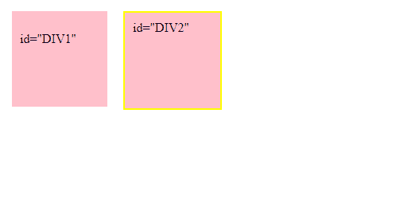

# jQuery | #id 选择器

> 原文:[https://www.geeksforgeeks.org/jquery-id-selector/](https://www.geeksforgeeks.org/jquery-id-selector/)

**#id 选择器**指定要选择的元素的 id。它不应该以数字开头，并且 id 属性在文档中必须是唯一的，这意味着它只能使用一次。

**语法:**

```html
$("#id")
```

**参数:**

*   **id:** 元素的特定 id。

**示例-1:**

```html
<!DOCTYPE html>
<html>

<head>
    <script src=
"https://ajax.googleapis.com/ajax/libs/jquery/3.3.1/jquery.min.js">
  </script>

  <script>
    $(document).ready(function() {
    $("#Geeks").css("background-color","red");
      });
  </script>
</head>

<body>

    <h1>GEEKS FOR GEEKS</h1>

    <p id="Geeks">jQuery|#id selector
  </p>

</body>

</html>
```

**输出:**


**示例-2:**

```html
<!DOCTYPE html>
<html lang="en">

<head>
    <meta charset="utf-8">
    <title>ID</title>
    <style>
        div {
            width: 100px;
            height: 100px;
            float: left;
            padding: 10px;
            margin: 10px;
            background-color: pink;
        }
    </style>
    <script src=
"https://code.jquery.com/jquery-1.10.2.js">
  </script>
</head>

<body>

    <div id="DIV1">
        <p>id="DIV1"</p>
    </div>
    <div id="DIV2">id="DIV2"</div>

    <script>
        $("#DIV2").css("border",
                       "2px solid yellow");
    </script>

</body>

</html>
```

**输出:**


**支持的浏览器:**

*   谷歌 Chrome
*   Mozilla Firefox
*   边缘
*   旅行队
*   歌剧