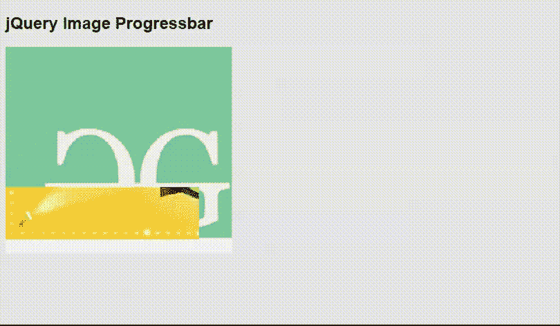

# jquery image progress bar 插件

> 哎哎哎::1230【https://www . geeksforgeeks . org/jquery-image-progress bar 插件/

在本文中，我们将学习如何使用 jQuery **图像进度条**插件实现图像进度条功能。

**注意:**请下载工作文件夹中的 jQuery [图像进度条](https://github.com/kelvinperrie/ProgressBar)插件，并在你的 HTML 代码的头部包含所需的文件。

> <link href="”progressbar.css”" rel="”stylesheet”" type="”text/css”/">
> <脚本 src = " jquery-3 . 3 . 1 . min . js "></脚本>
> <脚本 src = " jquery . progress bar . js "></脚本>

**示例:**以下示例使用 jQuery **createProgress()** 和 **getRandomNumber()** 函数演示了**图像进度条**插件的基本功能。这些功能利用插件的 **SetPercentage()** 方法来设置完成百分比。为了得到随机数，使用了 JavaScript 的 [**Math.ceil()**](https://www.geeksforgeeks.org/javascript-math-ceil-function/) 和 [**Math.floor()**](https://www.geeksforgeeks.org/javascript-math-floor-method/) 。
设置背景图像以及为进度条选择的图像。插件的选项*背景不透明度*也在代码的 jQuery 部分设置。

## 超文本标记语言

```html
<!DOCTYPE html>
<html>

<head>
    <title>jQuery Image Progress bars</title>
    <style>
        html {
            font-family: "Helvetica Neue", 
                    Arial, sans-serif;

            background-color: #e6e6e6;
        }
    </style>

    <link rel="stylesheet" type="text/css" 
            href="progressbar.css">
    <script type="text/javascript" 
        src="jquery-3.3.1.min.js">
    </script>
    <script type="text/javascript" 
        src="jquery.progressbar.js">
    </script>
</head>

<body>
    <h2>jQuery Image Progressbar</h2>
    <div id="imageDivID">
    </div>

    <script type="text/javascript">
        $(document).ready(function () {
            var myimage = $("#imageDivID").progressBar({
                imageUrl: 'images/gfg2.jpg',
                backgroundImageUrl: 'images/geeksimage.png',
                imageHeight: 280,
                imageWidth: 300,
                backgroundOpacity: 0.5
            });

            createProgress(myimage, 0);

        });

        function createProgress(
                imageProgressBar, currentVal) {
            var increment = getRandomNumber(0, 3);
            var newVal = currentVal + increment;
            if (newVal > 100) newVal = 100;
            if (currentVal == 100) newVal = 0;
            imageProgressBar.SetPercentage(newVal);
            setTimeout(function () {
                createProgress(imageProgressBar, newVal);
            }, 100);
        }

        function getRandomNumber(minVal, maxVal) {
            min = Math.ceil(minVal);
            max = Math.floor(maxVal);
            return Math.floor(Math.random() 
                    * (max - min + 1)) + min;
        }
    </script>
</body>

</html>
```

**输出:**

