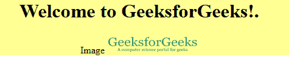

# jQuery |:图像选择器

> 原文:[https://www.geeksforgeeks.org/jquery-image-selector/](https://www.geeksforgeeks.org/jquery-image-selector/)

**:图像选择器**用于选择类型等于图像的输入元素。
**语法:**

```html
$(":image")
```

**参数:**
**:启用选择器:**用于选择 HTML 输入元素，改变其属性，如背景色等。

**例 1:**

```html
<!DOCTYPE html>
<html>
<head>
    <title>:image Selector</title>
<script src="https://ajax.googleapis.com/ajax/libs/jquery/3.3.1/jquery.min.js">
</script>

<script>
$(document).ready(function(){
  $(":image").css("height", "50px");
});
</script>

</head>
<body>
    <center>
      <form action="#">
          <h1>Welcome to GeeksforGeeks!</h1> 
          Image <input type="image" src="logo.png" width="31" height="30"> 
      </form>

</body>
</html>
```

**输出:**
它改变了图像的高度:

**例 2:**

```html
<!DOCTYPE html>
<html>
<head>
    <title>:image Selector</title>
<script src="https://ajax.googleapis.com/ajax/libs/jquery/3.3.1/jquery.min.js">
</script>

<script>
$(document).ready(function(){
  $(":image").css("width", "150px");
});
</script>

</head>
<body>
    <center>
      <div style="background-color: #ffff94;">
          <h1>Welcome to GeeksforGeeks!.</h1> 
          Image<input type="image" src="logo.png" width="31" height="30"> 
      </div>

</body>
</html>
```

**输出:**
