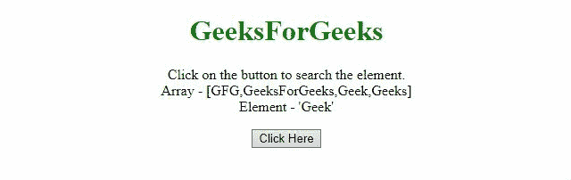
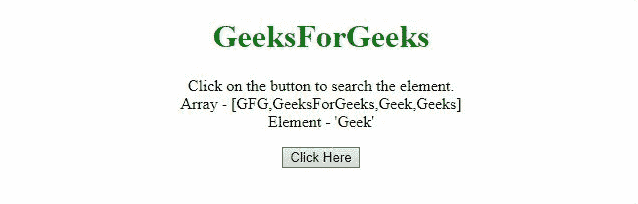

# JQuery | inArray()方法

> 原文:[https://www.geeksforgeeks.org/jquery-inarray-method/](https://www.geeksforgeeks.org/jquery-inarray-method/)

jQuery 中的这个 **inArray()方法**用于在数组中搜索一个特定的值并返回它的索引(如果没有找到则返回-1)。

**语法:**

```html
jQuery.inArray(val, arr [, Index])

```

**参数:**inArray()方法只接受上面提到的和下面描述的几个参数:

*   **val:** 要在数组中搜索的值。
*   **arr:** 任何类似数组的对象。
*   **索引:**开始搜索的数组的索引。

**返回值:**返回数组中元素的索引。

*   **示例 1:** 在本例中， **inArray()方法**搜索数组中的元素“极客”。

    ```html
    <!DOCTYPE HTML> 
    <html>

    <head> 
        <title> 
            JQuery | inArray() method
        </title>

        <script src = 
    "https://ajax.googleapis.com/ajax/libs/jquery/3.4.0/jquery.min.js">
        </script>
    </head> 

    <body style="text-align:center;"> 

        <h1 style="color: green"> 
            GeeksForGeeks 
        </h1> 

        <p id="GFG_UP"></p>

        <button onclick="gfg_Run()"> 
            Click Here 
        </button> 

        <p id="GFG_DOWN" style="color:green;"></p>

        <script> 
            var el_up = document.getElementById("GFG_UP"); 
            var el_down = document.getElementById("GFG_DOWN");

            var arr = ["GFG", "GeeksForGeeks", "Geek", "Geeks"];
            var val = "Geek";

            el_up.innerHTML = "Click on the button to "
                            + "search the element.<br>"
                            + "Array - [" + arr + 
                            "]<br>Element - '" + val + "'";

            function gfg_Run() { 
                el_down.innerHTML = $.inArray(val, arr); 
            } 
        </script> 
    </body> 

    </html>
    ```

*   **输出:**
    

*   **示例 2:** 在本例中， **inArray()方法**像前面的示例一样搜索数组中的元素“极客”。但是，index 属性也被传递来搜索索引 3 中的元素，并返回-1。

    ```html
    <!DOCTYPE HTML> 
    <html>

    <head> 
        <title> 
            JQuery | inArray() method
        </title>

        <script src = 
    "https://ajax.googleapis.com/ajax/libs/jquery/3.4.0/jquery.min.js">
        </script>
    </head> 

    <body style="text-align:center;"> 

        <h1 style="color: green"> 
            GeeksForGeeks 
        </h1> 

        <p id="GFG_UP"></p>

        <button onclick="gfg_Run()"> 
            Click Here 
        </button> 

        <p id="GFG_DOWN" style="color:green;"></p> 

        <script> 
            var el_up = document.getElementById("GFG_UP"); 
            var el_down = document.getElementById("GFG_DOWN");

            var arr = ["GFG", "GeeksForGeeks", "Geek", "Geeks"];
            var val = "Geek";

            el_up.innerHTML = "Click on the button to search"
                    + "the element.<br>Array - [" + arr + 
                    "]<br>Element - '" + val + "'"; 

            function gfg_Run() { 
                el_down.innerHTML = $.inArray(val, arr, 3); 
            } 
        </script> 
    </body>

    </html>
    ```

*   **输出:**
    