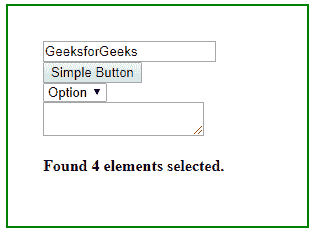

# jQuery |:输入选择器

> 原文:[https://www.geeksforgeeks.org/jquery-input-selector/](https://www.geeksforgeeks.org/jquery-input-selector/)

jQuery 中的**:输入选择器**用于选择输入元素。该选择器也用于按钮元素。

**语法:**

```html
$(":input")
```

**注意:** jQuery:输入选择器不仅选择输入元素，还选择按钮、下拉列表和文本区域元素。

**示例:**本示例使用:输入选择器对所有输入元素进行计数。

```html
<!DOCTYPE html>
<html>

<head> 
    <title>
        jQuery :input Selector
    </title>

    <style> 
        body { 
            width: 35%; 
            height: 150px; 
            border: 2px solid green; 
            padding: 35px; 
            margin: 10px; 
        }
    </style>

    <script src=
"https://ajax.googleapis.com/ajax/libs/jquery/3.3.1/jquery.min.js"> 
    </script> 
</head> 

<body> 

    <input type="text" value="GeeksforGeeks">

    <button type="button">
        Simple Button
    </button><br>

    <select>
        <option>Option</option>
    </select>

    <textarea></textarea>

    <h4 id="GFG"></h4>

    <!-- jQuery code to count all elements 
        selected by :input selector -->
    <script> 
        $(document).ready(function() {
            var allInputs = $(":input");
            $("#GFG").text("Found " + allInputs.length 
                    + " elements selected."); 
        });
    </script> 
</body> 

</html>                        
```

**输出:**
