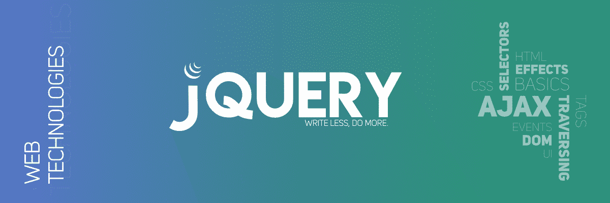

# jQuery 面试问答|第 2 集

> 原文:[https://www . geesforgeks . org/jquery-面试-问答-set-2/](https://www.geeksforgeeks.org/jquery-interview-questions-and-answers-set-2/)



我们已经在 [jQuery 面试问答| Set-1](https://www.geeksforgeeks.org/jquery-interview-questions-and-answers/)
中讨论了一些问题，下面是一些更相关的问题:

1.  **What are the basic selectors in jQuery ?**
    Following are the basic selectors in jQuery:
    *   元素标识
    *   CSS 名称
    *   标签名
    *   DOM 层次结构
2.  **What are the categories in jQuery Events ?**
    *   形式
    *   键盘
    *   老鼠
    *   浏览器
    *   文件加载

3.  **What are the browser related issues for jQuery ?**
    Compatibility with the Browsers of jQuery plugin is an issue.
4.  **[What is the use of css() method in JQuery ?](https://www.geeksforgeeks.org/jquery-css-method/)**
    The css() method in JQuery is used to change style property of the selected element. The css() property in JQuery can be used in different ways.
5.  **What is the difference between JavaScript and jQuery ?**
    jQuery is a library with APIs designed for JavaScript. JavaScript is an interpreted programming language. jQuery simplifies the use of the JavaScript language.
6.  **What are Events in jQuery ?**
    Responding to user actions on a webpage is called events. jQuery provides simple methods for attaching event handlers to selections. When an event occurs, the provided function is executed.
7.  **Whether we need to add a jQuery file in both the Master and Content page ?**
    jQuery file should be added to the Master page and can use access from the content page directly without having any reference to it.
8.  **Difference between [jQuery.size()](https://www.geeksforgeeks.org/jquery-size-with-examples/) and [jQuery.length](https://www.geeksforgeeks.org/jquery-length-property/) ?**
    **jQuery.size() method** is used to find the number of elements matched by the given selector and jQuery.length property is used to count number of the elements of the jQuery object. jQuery.length property is preferred because it does not have the overhead of a function call.
9.  **Can we call C# code behind using jQuery ?**
    Yes, we can call C# code from jQuery because it supports .net application.
10.  **如何在 jQuery 中读取、写入和删除 cookies？**
    使用面团饼干插件处理 jQuery 中的饼干。

*   创建 cookie:

    ```
    $.dough(“cookie_name”, “cookie_value”);
    ```

*   阅读 Cookie:

    ```
    $.dough(“cookie_name”);
    ```

*   删除 cookie:

    ```
    $.dough(“cookie_name”, “remove”);
    ```

*   **What is the difference between ID selector and class selector in jQuery ?**
    ID selector uses ID while the class selector uses a class to select elements. You can use an ID selector to pick only 1 element. If you want to select a group of elements, having the same CSS class, you can use the class selector.*   **What is the use of jQuery.data method ?**
    jQuery.data method is used to associate the {data|info|information} with the DOM nodes and also the objects. This data method makes the jQuery code clear and brief.*   **What is jQuery connect ?**
    A plug-in which is used to connect or bind a function with another function. Connect is used to execute a function whenever a function from another object or plug-in is executed.*   **What is the use of each function in jQuery ?**
    Each function is used to iterate each and every element of an object. It is used to loop DOM elements, arrays and the object properties.*   **Is jQuery required for bootstrap ?**
    Bootstrap uses jQuery for JavaScript plugins (like models, tooltips, etc). If just CSS part of Bootstrap is used, you don’t need jQuery.*   **What are the types of selectors in jQuery ?**
    There are three types of selectors in jQuery:
    *   CSS 选择器
    *   XPath 选择器
    *   自定义选择器*   **Can a jQuery library be used for server scripting ?**
    jQuery is designed with the functionality for client-side scripting. jQuery is not compatible with server-side scripting.*   **Why jQuery is better than JavaScript ?**
    jQuery is a library used for developing Ajax application and it helps to write the code clean and concise. It also handles events, animation, and Ajax support applications.*   **What is QUnit ?**
    QUnit is a powerful, easy-to-use JavaScript unit testing framework. It is used by the jQuery, jQuery UI, and jQuery Mobile projects and is capable of testing any generic JavaScript code.*   **用什么方法定义特定字符来代替$符号？**
    “NoConflict”方法用于引用一个 jQuery，并将其保存在一个变量中。该变量可以用来代替符号。