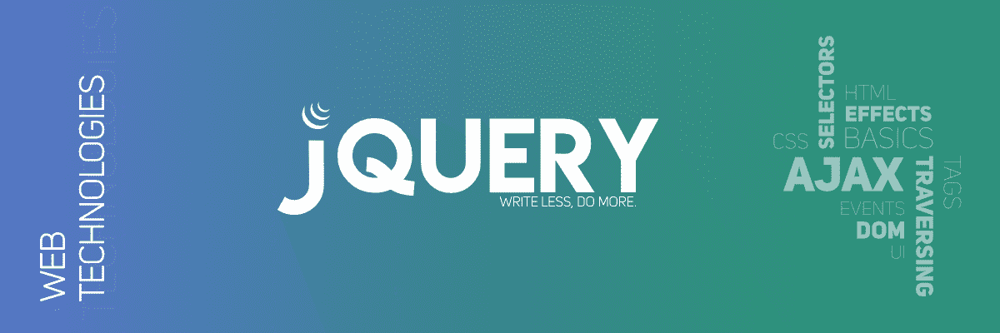

# jQuery 面试问答|集-3

> 原文:[https://www . geesforgeks . org/jquery-面试-问答-set-3/](https://www.geeksforgeeks.org/jquery-interview-questions-and-answers-set-3/)

我们已经讨论了一些 jQuery 面试问题。

*   [jQuery 面试问答|集-1](https://www.geeksforgeeks.org/jquery-interview-questions-and-answers/)
*   [jQuery 面试问答|第 2 集](https://www.geeksforgeeks.org/jquery-interview-questions-and-answers-set-2/)

以下是一些更相关的问题:

1.  **What is **[method chaining](https://www.geeksforgeeks.org/jquery-chaining/)** in jQuery ? What advantages does it offer ?**
    Method chaining is a feature of jQuery that allows chain together multiple methods in a single statement on a single element.
    **Advantage:** By combining or “chaining” multiple methods, you can seriously cut down on the number of times you make your browser look for the same elements without having to set any variables.
2.  **What is the difference between [jQuery.get()](https://www.geeksforgeeks.org/jquery-get-method/) and [jQuery.ajax()](https://www.geeksforgeeks.org/jquery-ajax-method/) method ?**
    The ajax() method in jQuery is used to perform an AJAX request or asynchronous HTTP request. The jQuery .get() method loads the data from server by using the GET HTTP request. This method returns XMLHttpRequest object.

3.  **What is a Data Table plug-in for jQuery ?**
    DataTables is a plug-in for the jQuery, JavaScript library. It is a highly versatile tool, built upon the foundations of progressive improvement, that adds advanced options to any HTML table.
4.  **Where jQuery code is getting executed ?**
    Client side (Browsers) are used to execute the jQuery codes.
5.  **Explain and contrast the usage of event.preventDefault() and event.stopPropagation() method.**
    The preventDefault() Method in jQuery is used to stop the default action of selected element to occur. It is used to check whether preventDefault() method is called for the selected element or not. The event.stopPropagation() method is an inbuilt method in jQuery which is used to stop the windows propagation. In the DOM tree, when setting an event with the child element and the parent element as well then if you hit on the child element event it will call both child and the parent element as well.
6.  **What is the proper way in jQuery to remove an element from the DOM before its Promise is resolved ?**
    A returned Promise in jQuery is connected to a delayed object stored on the data() for an element. Since the remove() method removes the element’s data still because of the element itself. It will prevent any of the element’s unresolved promises from resolving.
    Therefore, it is necessary to remove an element from the DOM before its Promise is resolved. Use detach() method instead and follow with removeData() method when resolution.
7.  **What is the slowest selector in jQuery ?**
    Class selectors are the slowest selectors in jQuery.
8.  **Which is the fastest selector in jQuery ?**
    ID and Element selector are the fastest selectors in jQuery.
9.  **What is the difference between document.ready() and window.onload() method ?**
    The document.ready() event happens once all HTML documents are loaded, however window.onload() happens once all content (including images) has been loaded. So, the document.ready() event fires first.
10.  **How method can be called inside code behind using jQuery ?**
    $.ajax can be called and by declaring Web Method inside code behind using jQuery.

11.  **How to work with parent(), children() and siblings() methods in jQuery ?**
    The parent() method returns the parent of the chosen element by calling the jQuery parent() method. The siblings() method returns all the siblings of given HTML elements.
12.  **What is the use of jQuery each function ?**
    jQuery each function is used to loop through each and every element of the target jQuery object. It is conjointly helpful for multi-element DOM, looping arrays and object properties.
13.  **Define slideToggle() effect ?**
    The slide methods do the up and down element. To implement slide up and down on jQuery element, the area unit the three methods:
    *   [下滑()](https://www.geeksforgeeks.org/jquery-slidedown-method/)
    *   [slideUp()](https://www.geeksforgeeks.org/jquery-slideup-with-examples/)
    *   [滑动切换（）](https://www.geeksforgeeks.org/jquery-slidetoggle-method/)
14.  **Where can we download JQuery ?**
    jQuery, JavaScript can be downloaded from jQuery official website – [https://jquery.com/](https://jquery.com/)
15.  **Define bind() and unbind() elements in jQuery ?**
    The jQuery bind() method attaches an event handler to elements, whereas unbind() detaches an existing event handler from elements. Use basic HTML code to form the HTML elements.
16.  **Is jQuery is a replacement of JavaScript ?**
    No, jQuery is not a replacement of JavaScript.
17.  **How to find browser and browser version in jQuery** ?
    Using $.browser property of jQuery returns the browser info.

    使用$。浏览器并不是 jQuery 本身建议的，因此这个特性被移到了 jQuery.migrate 插件中，如果用户愿意，可以下载这个插件。

    *   使用相同的方法是一种易受攻击的做法。仅在需要时使用。
    *   不使用特定于浏览器的代码会越来越高。
18.  **What are all the ways to include jQuery in a page ?**
    Following are the ways to incorporate jQuery during a page:
    *   脚本标记内的本地副本
    *   jQuery.com 的远程拷贝
    *   Ajax 应用编程接口的远程副本
    *   脚本管理器控件的本地副本
    *   使用客户端脚本对象的嵌入式脚本
19.  **How can we debug jQuery ?**
    There are two ways to debug jQuery code:
    Debugger keyword
    *   从我们必须开始调试的地方将调试器添加到行中，并使用 F5 功能键在调试模式下运行 Visual Studio。
    *   在附加进程后插入断点。
20.  **如何检查 jQuery 中任意变量的数据类型？**
    使用 **$。类型(对象)**方法获取对象的数据类型。