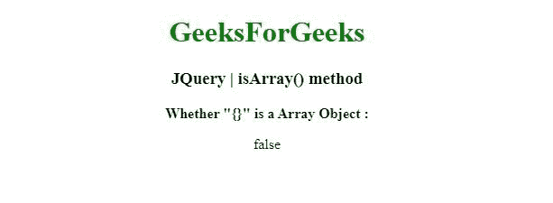
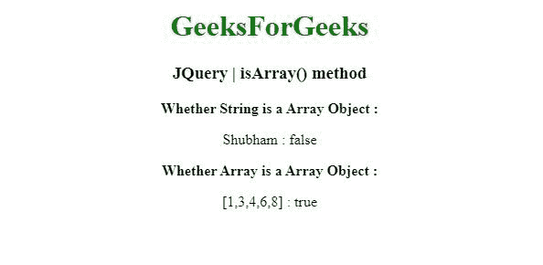

# JQuery | isArray()方法

> 原文:[https://www.geeksforgeeks.org/jquery-isarray-method/](https://www.geeksforgeeks.org/jquery-isarray-method/)

jQuery 中的这个 **isArray()** 方法用来判断参数是否为数组。

**语法:**

```html
jQuery.isArray( object )

```

**参数:**isArray()方法只接受上面提到的一个参数，下面将对其进行描述:

*   **对象:**该参数是测试是否为数组的对象。

**返回值:**返回布尔值。

以下示例说明了 isArray()方法在 jQuery 中的使用:

**示例 1:** 在本例中， **isArray()方法**检查参数是否为数组。

```html
<!DOCTYPE html>
<html>
<head>
<meta charset="utf-8">
<title>JQuery | isArray() method</title> 
<script src=
"https://code.jquery.com/jquery-3.4.1.js">
</script>

</head>
<body style="text-align:center;"> 

    <h1 style="color: green"> 
        GeeksForGeeks 
    </h1> 

    <h3>JQuery | isArray() method</h3>
    <b>Whether "{}" is a Array Object : </b>
    <p></p>
    <script>
    $( "p" ).append( "" + $.isArray("{}"));
    </script>
</body>
</html>                                                                                    
```

**输出:**


**示例 2:** 在本例中， **isArray()方法**也检查参数是否为数组。

```html
<!DOCTYPE html>
<html>
<head>
<meta charset="utf-8">
<title>JQuery | isArray() method</title> 
<script src="https://code.jquery.com/jquery-3.4.1.js"></script>

</head>
<body style="text-align:center;"> 

    <h1 style="color: green"> 
        GeeksForGeeks 
    </h1> 

    <h3>JQuery | isArray() method</h3>
    <b>Whether String is a Array Object : </b>
    <p id ="gfg"></p>
    <b>Whether Array is a Array Object : </b>
    <p id ="gfg1"></p>

    <script>
    // string ="Shubham"
    $( "#gfg" ).append( "Shubham : " + $.isArray("Shubham"));

    // array
    $( "#gfg1" ).append(
 "[1, 3, 4, 6, 8] : " + $.isArray([1, 3, 4, 6, 8]));

    </script>
</body>
</html>                                                                                                                                
```

**输出:**
