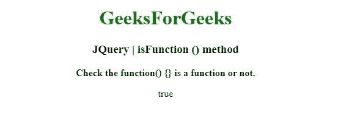
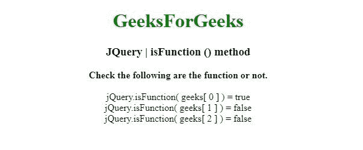

# JQuery | isFunction()方法

> 原文:[https://www.geeksforgeeks.org/jquery-isfunction-method/](https://www.geeksforgeeks.org/jquery-isfunction-method/)

jQuery 中的这个 **isFunction()** 方法用于确定其参数是否可以作为函数调用。

**语法:**

```html
jQuery.isFunction( value )

```

**参数:**IsFunction()方法只接受一个上面提到的和下面描述的参数:

*   **值:**该参数为待测值。

**返回值:**返回布尔值。

以下示例说明了 isNumeric()方法在 jQuery 中的使用:

**示例 1:** 在本例中， **isFunction()方法**检查一个值，看它是否是一个函数。

```html
<!DOCTYPE html>
<html>
<head>
<meta charset="utf-8">
<title>JQuery | isFunction () method</title> 
<script src="https://code.jquery.com/jquery-3.4.1.js"></script>

</head>
<body style="text-align:center;"> 

    <h1 style="color: green"> 
        GeeksForGeeks 
    </h1> 

    <h3>JQuery | isFunction () method</h3>
    <b>Check the function() {} is a function or not. </b>
    <br>
    <p></p>
    <script>

    //function() {}
    $( "p" ).append("" +$.isFunction(function() {}));

    </script>
</body>
</html>                                                            
```

**输出:**


**示例 2:** 在本例中， **isFunction()方法**也检查一个值，看它是否是一个函数。

```html
<!DOCTYPE html>
<html>
<head>
<meta charset="utf-8">
<title>JQuery | isFunction () method</title> 
<script src="https://code.jquery.com/jquery-3.4.1.js"></script>

</head>
<body style="text-align:center;"> 

    <h1 style="color: green"> 
        GeeksForGeeks 
    </h1> 

    <h3>JQuery | isFunction () method</h3>
    <b>Check the following are the function or not. </b>
    <br><br>
    <div>jQuery.isFunction( geeks[ 0 ] ) = <span></span></div>
    <div>jQuery.isFunction( geeks[ 1 ] ) = <span></span></div>
    <div>jQuery.isFunction( geeks[ 2 ] ) = <span></span></div>

    <script>
        function stub() {}
        var geeks = [
          function() {},
          { x:15, y:20 },
          null,
          stub,
          "function"
        ];

        jQuery.each( geeks, function( i ) {
          var isFunc = jQuery.isFunction( geeks[ i ]);
          $( "span" ).eq( i ).text( isFunc );
        });
    </script>
</body>
</html>                                                                                                        
```

**输出:**
