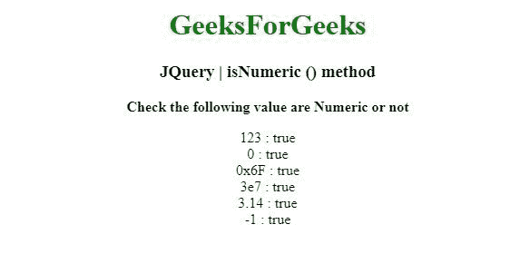
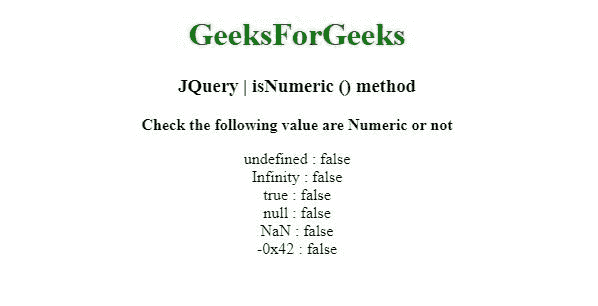

# JQuery | isNumeric()方法

> 原文:[https://www.geeksforgeeks.org/jquery-isnumeric-method/](https://www.geeksforgeeks.org/jquery-isnumeric-method/)

jQuery 中的这个 **isNumeric()** 方法用来确定它的参数是否代表一个 JavaScript 数。

**语法:**

```
jQuery.isNumeric( value )

```

**参数:**Isnumeric()方法只接受一个上面提到的参数，如下所述:

*   **值:**该参数为待测值。

**返回值:**返回布尔值。

以下示例说明了 isNumeric()方法在 jQuery 中的使用:

**示例 1:** 在本例中， **isNumeric()方法**检查一个值，看它是否是数字。

```
<!DOCTYPE html>
<html>
<head>
<meta charset="utf-8">
<title>JQuery | isNumeric () method</title> 
<script src="https://code.jquery.com/jquery-3.4.1.js"></script>

</head>
<body style="text-align:center;"> 

    <h1 style="color: green"> 
        GeeksForGeeks 
    </h1> 

    <h3>JQuery | isNumeric () method</h3>
    <b>Check the following value are Numeric or not </b>
    <br>
    <p></p>
    <script>

    //document.location
    $( "p" ).append("123 : " +$.isNumeric( 123 ) 
                +"<br>" + "0 : " + $.isNumeric( "0" )
                +"<br>" + "0x6F : " +$.isNumeric( "0x6F" )
                +"<br>" + "3e7 : " +$.isNumeric( "3e7" )
                +"<br>" + "3.14 : " +$.isNumeric( "3.14" )
                +"<br>" + "-1 : " + $.isNumeric( -1 ));

    </script>
</body>
</html>                                                
```

**输出:**


**示例 2:** 在本例中， **isNumeric()方法**还会检查一个值，看它是否是数字。

```
<!DOCTYPE html>
<html>
<head>
<meta charset="utf-8">
<title>JQuery | isNumeric () method</title> 
<script src=
"https://code.jquery.com/jquery-3.4.1.js"></script>

</head>
<body style="text-align:center;"> 

    <h1 style="color: green"> 
        GeeksForGeeks 
    </h1> 

    <h3>JQuery | isNumeric () method</h3>
    <b>Check the following value are Numeric or not </b>
    <br>
    <p></p>
    <script>

    //document.location
    $( "p" ).append("undefined  : " +$.isNumeric( undefined  ) 
                +"<br>" + "Infinity  : " + $.isNumeric( "Infinity " )
                +"<br>" + "true  : " +$.isNumeric( "true " )
                +"<br>" + "null  : " +$.isNumeric( "null " )
                +"<br>" + "NaN  : " +$.isNumeric( "NaN " )
                +"<br>" + "-0x42 : " + $.isNumeric( "-0x42" ));

    </script>
</body>
</html>                                                                                                
```

**输出:**
