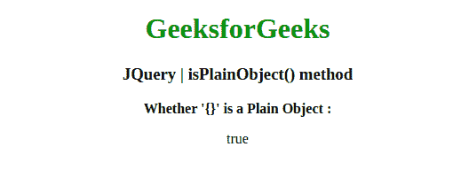
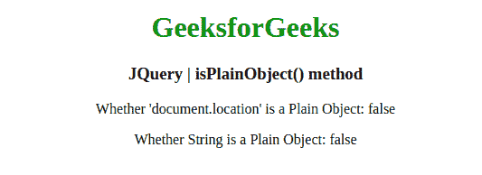

# JQuery | isplaynobject()方法

> 原文:[https://www.geeksforgeeks.org/jquery-isplainobject-method/](https://www.geeksforgeeks.org/jquery-isplainobject-method/)

jQuery 中的这个**isplaynobject()**方法是用来检查一个对象是否是普通对象的。

**语法:**

```
jQuery.isPlainObject( obj )
```

**参数:**该方法接受上面提到的和下面描述的单个参数:

*   **obj:** 此参数保存将被检查的对象，以查看它是否是普通对象。

**返回值:**返回布尔值。

以下示例说明了在 jQuery 中使用**isplaynobject()方法**:

**示例 1:** 在本例中，**isplaynobject()方法**检查一个对象，看它是否是普通对象。

```
<!DOCTYPE html>
<html>

<head>
    <meta charset="utf-8">
    <title>JQuery | isPlainObject() method</title>
    <script src=
"https://code.jquery.com/jquery-3.4.1.js">
    </script>

</head>

<body style="text-align:center;">

    <h1 style="color: green"> 
        GeeksforGeeks 
    </h1>

    <h3>JQuery | isPlainObject() method</h3>
    <b>Whether '{}' is a Plain Object : </b>
    <p></p>

    <script>
        $("p").append("" + $.isPlainObject({}));
    </script>
</body>

</html>
```

**输出:**


**示例 2:** 在本例中，**isplaynobject()方法**也会检查一个对象，看它是否是普通对象。

```
<!DOCTYPE html>
<html>

<head>
    <meta charset="utf-8">
    <title>JQuery | isPlainObject() method</title>
    <script src=
"https://code.jquery.com/jquery-3.4.1.js">
    </script>

</head>

<body style="text-align:center;">

    <h1 style="color: green"> 
        GeeksforGeeks 
    </h1>

    <h3>JQuery | isPlainObject() method</h3>
    <p id="geek1">
      Whether 'document.location' is a Plain Object: 
    </p>
    <p id="geek2">Whether String is a Plain Object: 
    </p>
    <script>

        // Document.location
        $("#geek1").append("" + $.isPlainObject(document.location));

        // string = "Shubham_Singh"
        $("#geek2").append("" + $.isPlainObject("Shubham_Singh"));
    </script>
</body>

</html>                                      
```

**输出:**
