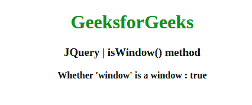
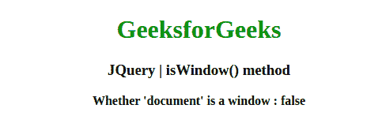

# JQuery | isWindow()方法

> 原文:[https://www.geeksforgeeks.org/jquery-iswindow-method/](https://www.geeksforgeeks.org/jquery-iswindow-method/)

jQuery 中的这个 **isWindow()** 方法用来判断参数是否为窗口。

**语法:**

```
jQuery.isWindow( obj )
```

**参数:**该方法接受上面提到的和下面描述的单个参数:

*   **obj:** 此参数保存对象以测试它是否是窗口。

**返回值:**返回布尔值。

以下示例说明了在 jQuery 中使用 **isWindow()方法**:

**示例 1:** 在本例中， **isWindow()方法**查找单词“Window”是否为窗口。

```
<!DOCTYPE html>
<html>

<head>
    <meta charset="utf-8">
    <title>JQuery | isWindow() method</title>
    <script src=
"https://code.jquery.com/jquery-3.4.1.js">
    </script>

</head>

<body style="text-align:center;">

    <h1 style="color: green"> 
        GeeksforGeeks 
    </h1>

    <h3>JQuery | isWindow() method</h3>
    <b>Whether 'window' is a window : </b>

    <script>
        $("b").append("" + $.isWindow(window));
    </script>
</body>

</html>
```

**输出:**


**例 2:** 在本例中， **isWindow()方法**查找单词“Window”是否为窗口。

```
<!DOCTYPE html>
<html>

<head>
    <meta charset="utf-8">
    <title>JQuery | isWindow() method</title>
    <script src=
"https://code.jquery.com/jquery-3.4.1.js">
    </script>

</head>

<body style="text-align:center;">

    <h1 style="color: green"> 
        GeeksforGeeks 
    </h1>

    <h3>JQuery | isWindow() method</h3>
    <b>Whether 'document' is a window : </b>

    <script>
        $("b").append("" + $.isWindow(document));
    </script>
</body>

</html>                                                  
```

**输出:**
