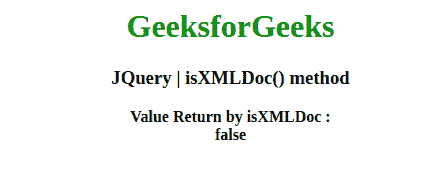

# JQuery | isXMLDoc()方法

> 原文:[https://www.geeksforgeeks.org/jquery-isxmldoc-method/](https://www.geeksforgeeks.org/jquery-isxmldoc-method/)

jQuery 中的这个 **isXMLDoc()** 方法用于检查 DOM 节点是否在 XML 文档中。

**语法:**

```html
jQuery.isXMLDoc( node )
```

**参数:**该方法接受上面提到的和下面描述的单个参数:

*   **节点:**该参数保存 DOM 节点，将检查该节点是否在 XML 文档中。

**返回值:**返回布尔值。

下面的例子说明了在 jQuery 中使用 **isXMLDoc()方法**:

**例 1:**

```html
<!DOCTYPE html>
<html>

<head>
    <meta charset="utf-8">
    <title>JQuery | isXMLDoc() method</title>
    <script src=
"https://code.jquery.com/jquery-3.4.1.js">
    </script>

</head>

<body style="text-align:center;">

    <h1 style="color: green"> 
        GeeksforGeeks 
    </h1>

    <h3>JQuery | isXMLDoc() method</h3>
    <b>Value Return by isXMLDoc : </b>
    <br>
    <b id="geek">
    </b>

    <script>
        var str = "A computer science portal for geeks",
            html = jQuery.parseHTML(str);

        document.getElementById("geek").innerHTML = 
          jQuery.isXMLDoc(html);
    </script>
</body>

</html>                                       
```

**输出:**


**例 2:**

```html
<!DOCTYPE html>
<html>

<head>
    <meta charset="utf-8">
    <title>JQuery | isXMLDoc() method</title>
    <script src=
"https://code.jquery.com/jquery-3.4.1.js">
    </script>

</head>

<body style="text-align:center;">

    <h1 style="color: green"> 
        GeeksforGeeks 
    </h1>

    <h3>JQuery | isXMLDoc() method</h3>
    <br>
    <b>Value Return By isXMLDoc :</b>
    <br>
    <b id="geek">
    </b>

    <script>
        var xml = "<rss version='2.0'>"+
                   "<channel>"+
                     "<body>String : parseXML</body>"+
                   "</channel>"+
                  "</rss>",
            xmlDoc = $.parseXML(xml);

        document.getElementById("geek").innerHTML = 
          jQuery.isXMLDoc(xmlDoc);
    </script>
</body>

</html>                    
```

**输出:**
