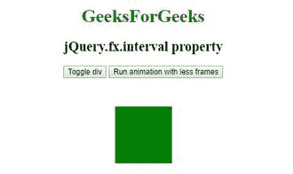

# jQuery | jQuery.fx.interval 属性带示例

> 原文:[https://www . geesforgeks . org/jquery-jquery-FX-interval-property-with-example/](https://www.geeksforgeeks.org/jquery-jquery-fx-interval-property-with-example/)

jQuery 中的 **jQuery.fx.interval 属性**用于修改动画每秒运行的帧数，并以毫秒为单位更改动画的触发率。它的默认值是 13 毫秒。

**语法:**

```
jQuery.fx.interval = milliseconds;
```

**参数:**该方法接受单参数**毫秒**，这是强制的。它用于以毫秒为单位指定动画发射速率。它的默认值是 13 毫秒。

**示例 1:** 本示例使用 jQuery.fx.interval 属性来更改动画发射速率。

```
<!DOCTYPE html>
<html>

<head> 
    <title>
        jQuery jQuery.fx.interval Property
    </title>

    <script src=
"https://ajax.googleapis.com/ajax/libs/jquery/3.3.1/jquery.min.js">
    </script>

    <style>
        .box {
            background:green;
            height:100px;
            width:100px;
            margin:50px;
        }
    </style>
</head> 

<body>
    <center>
        <h1 style = "color:green;" >  
            GeeksForGeeks
        </h1>  

        <h2> jQuery.fx.interval property</h2>

        <button id="toggle">
            Toggle div
        </button>

        <button id="interval">
            Run animation with less frames
        </button>

        <div class="box"></div>

        <!-- Script to illustrate jQuery.fx.interval
            property -->
        <script>
            $(document).ready(function(){
                $("#toggle").on("click", function() {
                    $("div").toggle(5000);
                });

                $("#interval").on("click", function() {
                    jQuery.fx.interval = 500;
                });
            });
        </script>
    </center>
</body>

</html>  
```

**输出**


**示例 2:** 本示例使用 jQuery.fx.interval 属性来更改动画发射速率。

```
<!DOCTYPE html>
<html>

<head> 
    <title>
        jQuery jQuery.fx.interval Property
    </title>

    <script src=
"https://ajax.googleapis.com/ajax/libs/jquery/3.3.1/jquery.min.js">
    </script>

    <style>
        .box {
            background:green;
            height:100px;
            width:100px;
            margin:50px;
        }
    </style>
</head> 

<body>
    <center>
        <h1 style = "color:green;" >  
            GeeksForGeeks
        </h1>  

        <h2> jQuery.fx.interval property</h2>

        <button id="toggle">
            Toggle div
        </button>

        <button id="interval">
            Run animation with less frames
        </button>

        <div class="box"></div>

        <!-- Script to illustrate jQuery.fx.interval
            property -->
        <script>
            $(document).ready(function(){
                $("#toggle").on("click", function() {
                    $("div").toggle(500);
                });

                $("#interval").on("click", function() {
                    jQuery.fx.interval = 5000;
                });
            });
        </script>
    </center>
</body>

</html>  
```

**输出:**
