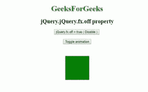

# jQuery | jQuery.fx.off 属性

> 原文:[https://www . geesforgeks . org/jquery-jquery-FX-off-property/](https://www.geeksforgeeks.org/jquery-jquery-fx-off-property/)

jQuery 中的 **jQuery.fx.off 属性**用于全局禁用/启用所有动画。其默认值为 false，用于允许动画正常运行。

**语法:**

```html
jQuery.fx.off = true|false;
```

**参数:**该事件接受两个参数，如上所述，如下所述:

*   **true:** 用于指定动画应被禁用。
*   **false:** 用于指定动画应启用。

**示例:**本示例使用 jQuery.fx.off 属性禁用动画。

```html
<!DOCTYPE html>
<html>

<head> 
    <title>
        jQuery jQuery.fx.off property
    </title>

    <script src=
"https://ajax.googleapis.com/ajax/libs/jquery/3.3.1/jquery.min.js">
    </script>

    <style>
        .box {
            background:green;
            height:100px;
            width:100px;
            margin:50px;
        }
    </style>
</head> 

<body>
    <center>  
        <h1 style = "color:green;" >  
            GeeksForGeeks
        </h1>  

        <h2> jQuery.jQuery.fx.off property</h2>

        <button id="disable">
            jQuery.fx.off = true ( Disable )
        </button>

        <br><br>

        <button id="toggle">
            Toggle animation
        </button>

        <div class="box"></div>

        <!-- Script to use jQuery.fx.off property -->
        <script>
            $(document).ready(function() {
                $("#disable").click(function() {
                    jQuery.fx.off = true;
                });

                $("#toggle").click(function() {
                    $("div").toggle("slow");
                });
            });
        </script>
    </center>
</body>

</html>  
```

**输出:**
**之前点击禁用按钮:**

**之后点击禁用按钮:**


**示例 2:** 本示例使用 jQuery.fx.off 属性来禁用和启用动画。

```html
<!DOCTYPE html>
<html>

<head> 
    <title>
        jQuery.jQuery.fx.off property
    </title>

    <script src=
"https://ajax.googleapis.com/ajax/libs/jquery/3.3.1/jquery.min.js">
    </script>

    <style>
        .box {
            background:green;
            height:100px;
            width:100px;
            margin:50px;
        }
    </style>
</head> 

<body>
    <center>  
        <h1 style = "color:green;" >  
            GeeksForGeeks
        </h1>  

        <h2>jQuery.jQuery.fx.off property</h2>

        <button id="disable">
            jQuery.fx.off = true ( Disable )
        </button>

        <button id="enable">
            jQuery.fx.off = false ( Enable )
        </button>

        <br><br>

        <button id="toggle">
            Toggle animation
        </button>

        <div class="box"></div>

        <!-- Script to use jQuery.fx.off property -->
        <script>
            $(document).ready(function(){
            $("#disable").click(function(){
                jQuery.fx.off = true;
            });

            $("#enable").click(function(){
                jQuery.fx.off = false;
            });

            $("#toggle").click(function(){
                $("div").toggle("slow");
            });
        });
        </script>
    </center>
</body>

</html>  
```

**输出:**
**同时使用禁用和启用按钮:**
