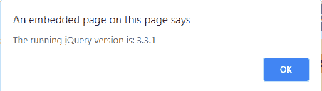

# jQuery | jquery 属性

> 原文:[https://www.geeksforgeeks.org/jquery-jquery-property/](https://www.geeksforgeeks.org/jquery-jquery-property/)

**jquery 属性**用于返回 jquery 版本号。

**语法**

```
$().jquery
```

**示例:**返回版本号。

```
<!DOCTYPE html>
<html>

<head>
    <style>
        h1 {
            color: green;
        }
    </style>
    <script src=
"https://ajax.googleapis.com/ajax/libs/jquery/3.3.1/jquery.min.js">
  </script>

  <script>
        $(document).ready(function() {

            $("button").on(
              "click", function() {
                var cu_version = $().jquery;

                alert("The running jQuery version is: "
                      + cu_version);
            });
        });
    </script>
</head>

<body>
    <center>
        <h1>Geeks for Geeks</h1>
            <button>
              Check
      </button>
    </center>
</body>

</html>
```

**输出:**
**前:**


**之后:**
