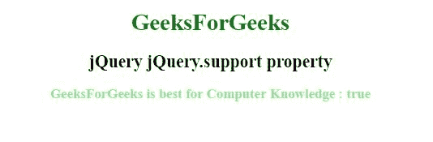
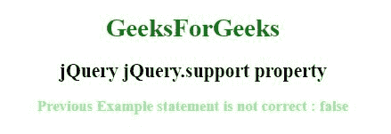

# jQuery | jQuery.support 属性

> 原文:[https://www . geesforgeks . org/jquery-jquery-support-property/](https://www.geeksforgeeks.org/jquery-jquery-support-property/)

jQuery 中的 **jQuery.support 属性**包含用于表示不同浏览器功能或错误的属性集合。

**语法:**

```
jQuery.support.propvalue
```

**参数:**该属性包含单个参数**属性值**，这是必需的。它用于指定要测试的函数。包括的测试有:

*   创建交互式、快速动态网页应用的网页开发技术
*   箱体模型
*   改变气泡
*   检查克隆
*   检查
*   克-奥二氏分级量表
*   css 浮动
*   hrefNormalized
*   html 序列化
*   leadingWhitespace
*   noCloneChecked
*   noCloneEvent
*   不透明
*   optDisabled
*   optSelected
*   scriptEval()
*   风格
*   提交气泡
*   第比利斯

**示例 1:** 本示例使用 jQuery.support 属性向浏览器发送文本，以创建一个 XMLHttpRequest 对象。

```
<!DOCTYPE html>
<html>

<head> 
    <title>
        jQuery jQuery.support property
    </title>

    <script src=
"https://ajax.googleapis.com/ajax/libs/jquery/3.3.1/jquery.min.js">
    </script>
</head> 

<body>
    <center>  
        <h1 style = "color:green;" >  
            GeeksForGeeks
        </h1>  

        <h2> jQuery jQuery.support property</h2>

        <h3 style="color:lightgreen;" ></h3>

        <!-- Script to use jQuery.support property -->
        <script>
            $(document).ready(function() {
                $("h3").html("GeeksForGeeks is best for"
                        + " Computer Knowledge : " 
                        + jQuery.support.ajax);
            });
        </script>
    </center>
</body>

</html>  
```

**输出:**


**示例 2:** 此示例用 cors 参数值说明了 jQuery.support 属性。

```
<!DOCTYPE html>
<html>

<head> 
    <title>
        jQuery jQuery.support property
    </title>

    <script src=
"https://ajax.googleapis.com/ajax/libs/jquery/3.3.1/jquery.min.js">
    </script>
</head> 

<body>
    <center>  
        <h1 style = "color:green;" >  
            GeeksForGeeks
        </h1>  

        <h2>jQuery jQuery.support property</h2>

        <h3 style="color:lightgreen;" ></h3>

        <!-- Script to use jQuery.support property -->
        <script src=
"https://ajax.googleapis.com/ajax/libs/jquery/3.3.1/jquery.min.js">
        </script>

        <script>
            $(document).ready(function() {
                $.support.cors = false;
                $("h3").html(" Previous Example statement is not"
                        + " correct : " + jQuery.support.cors);
            });
        </script>
    </center>
</body>

</html>  
```

**输出:**
