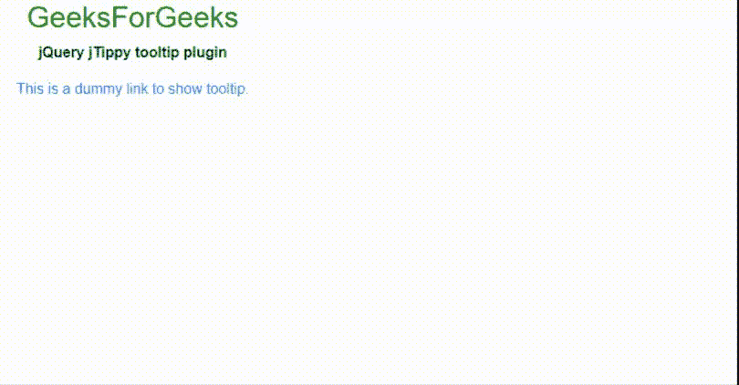
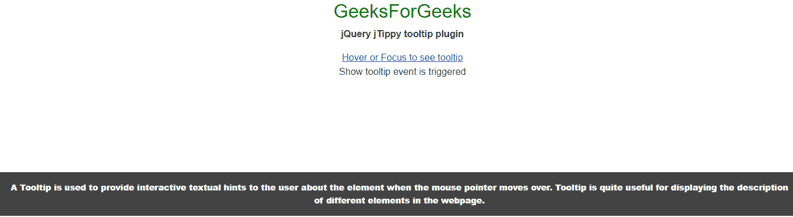
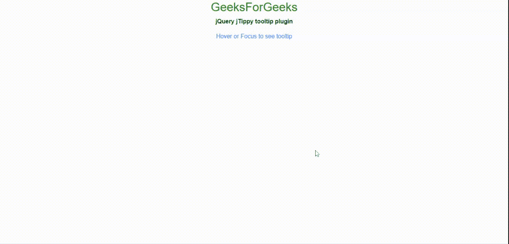

# jquery jtippy tooltip plugin

> 哎哎哎::1230【https://www . geeksforgeeks . org/jquery-jtippy 工具提示插件/

在本文中，我们将学习如何使用 jQuery **jTippy Tooltip** 插件实现工具提示功能。

**注意:**请下载工作文件夹中的 jQuery [**jTippy**](https://github.com/HTMLGuyLLC/jTippy) 插件，并在你的 HTML 代码头部包含所需文件。

> <link href="”https://stackpath.bootstrapcdn.com/bootstrap/4.1.3/css/bootstrap.min.css”&nbsp;<br/"> rel= "样式表" type="text/css"/ >
> 
> <link href="”https://stackpath.bootstrapcdn.com/font-awesome/4.7.0/css/font-awesome.min.css”&nbsp;<br/"> rel= "样式表" type="text/css"/ >
> 
> <link href="”https://cdnjs.cloudflare.com/ajax/libs/highlight.js/9.12.0/styles/darcula.min.css”&nbsp;<br/"> rel= "样式表" type="text/css"/ >
> 
> <link href="”jTippy.css”" rel="”stylesheet”" type="”text/css”/">
> 
> <脚本 src = " jtippy . min . js "></脚本>

**示例 1:** 以下示例演示了 **jTippy 工具提示**插件的基本功能。

## 超文本标记语言

```html
<!DOCTYPE html>
<html>
    <head>
        <meta http-equiv="Content-Type"
              content="text/html; charset=UTF-8" />

        <title>jQuery jTippy Tooltip Plugin</title>

        <meta name="description"
              content="jQuery tooltip plugin" />
        <meta content="width=800, initial-scale=1" 
              name="viewport" />

        <link
            rel="stylesheet"
            href=
"https://stackpath.bootstrapcdn.com/bootstrap/4.1.3/css/bootstrap.min.css"
            integrity=
"sha384-MCw98/SFnGE8fJT3GXwEOngsV7Zt27NXFoaoApmYm81iuXoPkFOJwJ8ERdknLPMO"
            crossorigin="anonymous"/>
        <link
            rel="stylesheet"
            href="https://stackpath.bootstrapcdn.com/font-awesome/4.7.0/
        css/font-awesome.min.css"/>
        <link
            rel="stylesheet"
            href=
"https://cdnjs.cloudflare.com/ajax/libs/highlight.js/9.12.0/styles/darcula.min.css"/>
        <link rel="stylesheet" href="jTippy.css" />
        <script src=
"https://code.jquery.com/jquery-3.5.1.min.js">
        </script>
        <script src="jTippy.min.js"></script>
        <style>
            body,
            html {
                height: 60%;
                width: 60%;
                margin: 0px;
                font-family: Arial;
            }
        </style>
    </head>
    <body class="body text-center">
        <h2 style="color: green;">GeeksForGeeks</h2>
        <b>jQuery jTippy tooltip plugin </b>

<p></p>

        <a href="#" data-toggle="tooltip" title="This is tooltip">
            This is a dummy link to show tooltip.
        </a>

        <script>
            $(function () {
                $('[data-toggle="tooltip"]').jTippy();
            });
        </script>
    </body>
</html>
```

**输出:**



**示例 2:** 以下示例演示了各种选项设置和事件触发功能的使用。下面只使用了几个，开发人员可以根据应用程序的需要来探索和使用它们。当工具提示显示给用户时，触发**on(【JT-show】)**事件，该事件在 HTML *div* 中显示消息，其 id 为**【show divided】*。一旦**打开(‘JT-hide’)**事件被触发，消息 *div* 被隐藏。*

## *超文本标记语言*

```html
*<!DOCTYPE html>
<html>
    <head>
        <meta http-equiv="Content-Type" 
              content="text/html; charset=UTF-8" />

        <title>jQuery jTippy Tooltip Plugin</title>

        <meta name="description" 
              content="jQuery tooltip plugin" />
        <meta content="width=800, initial-scale=1" 
              name="viewport" />

        <link
            rel="stylesheet"
            href=
"https://stackpath.bootstrapcdn.com/bootstrap/4.1.3/css/bootstrap.min.css"
            integrity=
"sha384-MCw98/SFnGE8fJT3GXwEOngsV7Zt27NXFoaoApmYm81iuXoPkFOJwJ8ERdknLPMO"
            crossorigin="anonymous"/>
        <link
            rel="stylesheet"
            href=
"https://stackpath.bootstrapcdn.com/font-awesome/4.7.0/css/font-awesome.min.css"/>
        <link
            rel="stylesheet"
            href=
"https://cdnjs.cloudflare.com/ajax/libs/highlight.js/9.12.0/styles/darcula.min.css"/>
        <link rel="stylesheet" href="jTippy.css" />
        <script src=
"https://code.jquery.com/jquery-3.5.1.min.js">
        </script>
        <script src="jTippy.min.js"></script>
        <style>
            body,
            html {
                height: 100%;
                margin: 0px;
                font-family: Arial;
            }
        </style>
    </head>
    <body class="body text-center">
        <h2 style="color: green;">GeeksForGeeks</h2>
        <b>jQuery jTippy tooltip plugin </b>

<p></p>

        <a
            href="#"
            data-toggle="tooltip"
            title="A Tooltip is used to provide interactive
                   textual hints to the user about the element
                   when the mouse pointer moves over. Tooltip is 
                   quite useful for displaying the description of
                   different elements in the webpage.">
            Hover or Focus to see tooltip
        </a>

        <div id="showDivID"></div>

        <!-- Option settings and  events trigger-->
        <script>
            $(function () {
                $('[data-toggle="tooltip"]')
                    .jTippy({
                        title: "Trying out jTippy tooltips",
                        // The tooltip is displayed on mouse 
                        // over and focus event
                        trigger: "hoverfocus",
                        size: "medium",
                        position: "auto",
                        backdrop: false,
                        theme: "black",
                        singleton: true,
                        close_on_outside_click: true,
                    })
                    .on("jt-show", function (e, tooltip, hide) {
                        // triggered on show tooltip ;
                        $("#showDivID").html("Show tooltip event is triggered");
                    })
                    .on("jt-hide", function (e) {
                        //triggered on tooltip hide
                        $("#showDivID").hide();
                    });
            });
        </script>
    </body>
</html>*
```

***输出:*** 

**

***显示事件触发器的输出:*** 

**