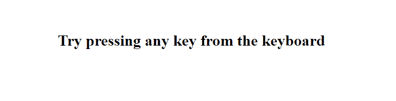
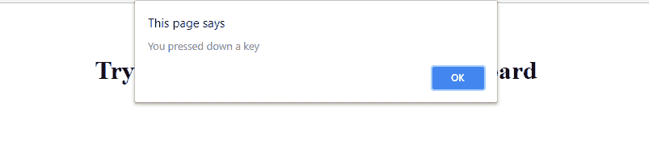
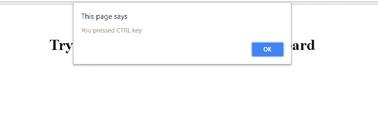

# jQuery | Keydown()带示例

> 原文:[https://www.geeksforgeeks.org/jquery-keydown-with-examples/](https://www.geeksforgeeks.org/jquery-keydown-with-examples/)

**向下键()**是 jQuery 中的一个内置方法，用于在用户按下键盘上的某个键时触发向下键事件。如果按键保持按下状态，则每次操作系统重复按键时都会发送事件。因此，使用 keydown()方法，我们可以检测到是否有任何键正在下降。
**语法:**

```
$(selector).keydown(function) 

```

这里选择器是被选择的元素。
**参数:**它接受一个可选参数作为一个函数，给出是否按下任何键的想法。
**返回值:**返回是否按了任何键或按了哪个键。
**jQuery 代码显示按键的工作方式()方法:**
**代码#1:**
下面的代码用于检查一个按键是否正在按下。

```
<title>Jquery | Keydown() </title>
    $(document).keydown(function(event) {

        alert('You pressed down a key');
    });

        <h1>Try pressing any key from the keyboard </h1>

```

**输出:**
按下运行按钮后-


按任意键-
后

**代码#2:**
下面的代码用于检查从键盘上按下了哪个特定的键和事件。键码和事件。哪个将返回按下的键的 UNICODE 值，两者都是浏览器特定的。

```
<title>Jquery | Keydown() </title>

$(document).keydown(function(event) {

    var key = (event.keyCode ? event.keyCode : event.which);

    if (key >= '65' && key = '96' && key = '48' && key = '112' && key <= '123')
        alert('You pressed FUNCTION key - ' + (key - 111));

    else if (key == '144')
        alert('You pressed NUMLOCK key');

    else if (key == '145')
        alert('You pressed SCROLL LOCK key');

    else
        alert('You pressed SPECIAL CHARACTER key');

});

<br>
<br>

    <h1>Try pressing any key from the keyboard </h1>

```

**输出:**
按下运行按钮后-


按任意键-
后