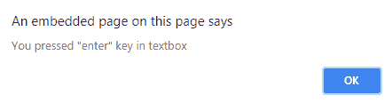

# jQuery | keypress()

> 哎哎哎:# t0]https://www . geeksforgeeks . org/jquery-key press/

每当浏览器注册键盘输入时，jQuery 中的 keypress()方法都会触发 keypress 事件。因此，使用 keypress()方法可以检测是否有任何键被按下。
**语法:**
要触发所选元素的按键事件:

```
$(selector).keypress()

```

要将功能附加到按键事件:

```
$(selector).keypress(function) 

```

<center>**jQuery code to show the working of keypress() Method:**</center>

**Code #1:**
Below code is used to check if a key is pressed anywhere on the page or not.

```
<html>
<head>
<title>Jquery | Keypress() </title>
<script src="https://cdnjs.cloudflare.com/ajax/libs/jquery/2.1.3/jquery.min.js">
</script>
</head>
<script>
$(document).keypress(function(event){

        alert('You pressed a key');    
});
</script>
<body>
</script>
</body>
</html>
```

**输出:**

**代码#2:**
检测任何特定的按键事件。键码和事件。哪一个将返回按下的按键的 ASCII 值，两者都是浏览器特定的。下面的代码用于检查在页面上按下了哪个键。

```
<html>
<head>
<title>Jquery | Keypress() </title>
<script src="https://cdnjs.cloudflare.com/ajax/libs/jquery/2.1.3/jquery.min.js">
</script>
</head>
<script>
$(document).keypress(function(event){

    var key = (event.keyCode ? event.keyCode : event.which);
    var ch=String.fromCharCode(key)
        alert('You pressed key : ' +ch);    

});
</script>
<body>
<br><br>
<center>
<h1>Try pressing any printable character from the keyboard </h1>
</center>
</body>
</html>
```

**输出:**

如果按下任何键，则输出将为-

**代码#3**
下面的代码用于检查在页面的文本框内是否按下了回车键。

```
<html>
<head>
<title>Jquery | Keypress() </title>
<script src="https://cdnjs.cloudflare.com/ajax/libs/jquery/2.1.3/jquery.min.js">
</script>
</head>
<body>

<center> 
        <br><br>
    <h1>Press " Enter key " inside the textbox </h1>
    <input id="textbox" type="text" size="50" />
</center>
<script type="text/javascript">

$('#textbox').keypress(function(event){

    var keycode = (event.keyCode ? event.keyCode : event.which);
    if(keycode == '13'){
        alert('You pressed  "enter" key in textbox');    
    }
    event.stopPropagation();
});

</script>
</body>
</html>
```

**输出:**

当在上述文本框内按下回车键时，输出如下所示-


**注意:**对于所有按键，如非打印字符(如 ALT、CTRL、SHIFT、ESC)，按键事件不会被触发。keydown()方法可以用来检查这些键。