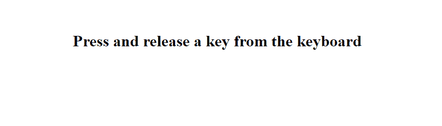
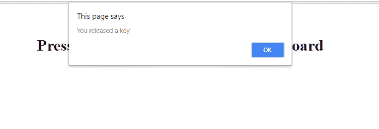
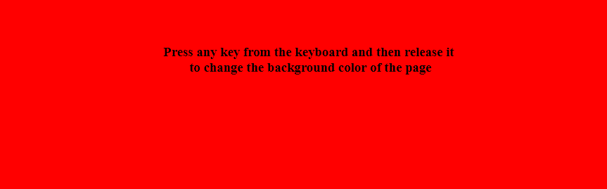

# jQuery | keyup()带示例

> 原文:[https://www.geeksforgeeks.org/jquery-keyup-with-examples/](https://www.geeksforgeeks.org/jquery-keyup-with-examples/)

**快捷键()**是 jQuery 中的一个内置方法，用于在用户从键盘上释放一个键时触发快捷键事件。因此，使用 keyup()方法，我们可以检测是否有任何键从键盘释放。

**语法:**

```
$(selector).keyup(function) 

```

这里选择器是被选择的元素。

**参数:**它接受一个可选参数作为一个函数，给出是否按下任何键的想法。

**返回值:**返回是否按下任何键，并相应改变背景颜色。

<center>**jQuery code to show the working of keyup() Method:**</center>

**Code #1:**
Below code is used to check if a keyboard key is released after being pressed.

```
<html>

<head>
    <title>Jquery | Keyup() </title>
    <script
src="https://cdnjs.cloudflare.com/ajax/libs/jquery/2.1.3/jquery.min.js">
    </script>
</head>
<script>
    $(document).keyup(function(event) {

        alert('You released a key');
    });
</script>

<body>
    <br>
    <br>
    <center>
        <h1>Press and release a key from the keyboard </h1>
    </center>
</body>

</html>
```

**输出:**
后运行代码:


从键盘上按下任意键后-


**代码:#2**
下面的代码用于每当键盘释放一个键时改变页面的背景颜色

```
<html>

<head>
    <title>Jquery | Keyup() </title>
    <script
src="https://cdnjs.cloudflare.com/ajax/libs/jquery/2.1.3/jquery.min.js">
    </script>
</head>
<script>
    var colors = ['red', 'blue', 'green', 'grey',
                 'black', 'white', 'teal', 'yellow'];
    var i = 0;
    $(document).keyup(function(event) {

        $('body').css('background-color', colors[i]);
        i++;
        i = i % 9;

    });
</script>

<body>
    <br>
    <br>
    <center>
        <h3>
     Press any key from the keyboard and then release it <br>
     to change the background color of the page
</h3>
    </center>
</body>

</html>                                       
```

**输出:**
按键前:

每次按下键盘上的任意一个键并松开时，页面的背景颜色会变成新的颜色-

按下并释放任意键后:


