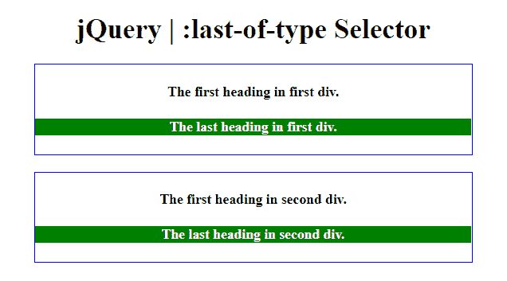
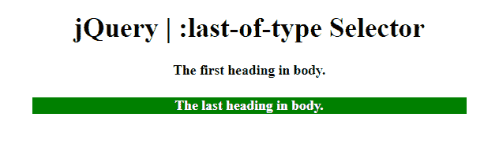

# jQuery |:最后一个类型选择器

> 原文:[https://www.geeksforgeeks.org/jquery-last-of-type-selector/](https://www.geeksforgeeks.org/jquery-last-of-type-selector/)

**:最后一个类型选择器**用于选择其父元素的最后一个子元素。

**语法:**

```html
$(":last-of-type")
```

以下示例说明了 jQuery 中的:最后一个类型选择器:

**示例 1:** 本示例将父元素(div 标签)的背景颜色更改为绿色，文本颜色更改为白色。

```html
<!DOCTYPE html>  
<html>  
    <head> 
        <title> 
            jQuery | :last-of-type Selector
        </title>

        <script src=
"https://ajax.googleapis.com/ajax/libs/jquery/3.3.1/jquery.min.js">
        </script>

        <!-- Script to use last-of-type selector -->
        <script>
            $(document).ready(function() {
                $("h4:last-of-type").css({
                    "background-color": "green", 
                    "color": "white"
                });
            });
        </script>

        <!-- CSS property to set style of element -->
        <style>
           option {
            font-weight: bold;
            font-size: 25px;
            color: green;
           }
           select {
            font-weight: bold;
            font-size: 25px;
            color: green;
           }
        </style>
    </head> 

    <body style="text-align:center;">  
        <h1>  
            jQuery | :last-of-type Selector
        </h1> 

        <div style= "border:1px solid blue;">
            <h4>The first heading in first div.</h4>
            <h4>The last heading in first div.</h4>
        </div><br>

        <div style= "border:1px solid blue;">
            <h4>The first heading in second div.</h4>
            <h4>The last heading in second div.</h4>
        </div>
    </body>  
</html>    
```

**输出:**


**示例 2:** 本示例将<正文>标签的最后一个标题的背景颜色更改为绿色，文本颜色更改为白色。

```html
<!DOCTYPE html>  
<html>  
    <head> 
        <title> 
            jQuery | :last-of-type Selector
        </title>

        <script src=
"https://ajax.googleapis.com/ajax/libs/jquery/3.3.1/jquery.min.js">
        </script>

        <!-- Script to use last-of-type selector -->
        <script>
            $(document).ready(function() {
                $("h4:last-of-type").css({
                    "background-color": "green", 
                    "color": "white"
                });
            });
        </script>

        <style>
            option {
                font-weight: bold;
                font-size: 25px;
                color: green;
            }
            select {
                font-weight: bold;
                font-size: 25px;
                color: green;
            }
        </style>
    </head> 

    <body style="text-align:center;">  
        <h1>  
            jQuery | :last-of-type Selector
        </h1>  
        <h4>The first heading in body.</h4>

        <h4>The last heading in body.</h4>

    </body>  
</html>      
```

**输出:**
