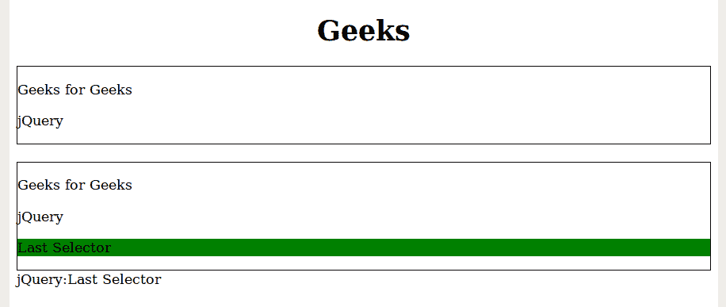

# jQuery |:最后一个选择器

> 原文:[https://www.geeksforgeeks.org/jquery-last-selector/](https://www.geeksforgeeks.org/jquery-last-selector/)

它是一个 **jQuery 选择器**，用于选择指定类型的最后一个元素。
**语法:**

```
$(":last")
```

**返回值:**选择并返回最后一个元素。
**示例-1:**

## 超文本标记语言

```
<!DOCTYPE html>
<html>
<h1>
  <center>
    Geeks 
  </center>
  </h1>

<head>
    <script src=
"https://ajax.googleapis.com/ajax/libs/jquery/3.3.1/jquery.min.js">
  </script>
    <script>
        $(document).ready(function() {
            $("p:last").css(
              "background-color", "green");
        });
    </script>
</head>

<body>

<p>Geeks for Geeks</p>

<p>jQuery</p>

<p>Last Selector</p>

</body>

</html>
```

**输出:**


**示例-2:**

## 超文本标记语言

```
<!DOCTYPE html>
<html>
<h1>
  <center>
    Geeks 
  </center>
  </h1>

<head>
    <script src=
"https://ajax.googleapis.com/ajax/libs/jquery/3.3.1/jquery.min.js">
  </script>

  <script>
        $(document).ready(function() {
            $("p:last").css(
              "background-color", "green");
        });
    </script>
</head>

<body>
    <div style="border:1px solid;">

<p>Geeks for Geeks</p>

<p>jQuery</p>

    </div>
    <br>

    <div style="border:1px solid;">

<p>Geeks for Geeks</p>

<p>jQuery</p>

<p>Last Selector</p>

    </div>

    <div>jQuery:Last Selector</div>

</body>

</html>
```

**输出:**



**注意:**上面的代码只会选择第二个 div 的最后一个< p >元素。要选择第一个 div 的最后一个< p >元素，请使用:最后一个子选择器。

**支持的浏览器:**

*   谷歌 Chrome 90.0+
*   Internet Explorer 9.0
*   Firefox 3.6
*   Safari 4.0
*   歌剧 10.5