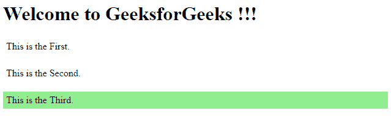
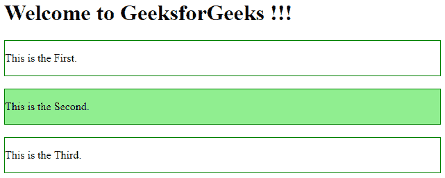

# jQuery |最后()举例

> 原文:[https://www.geeksforgeeks.org/jquery-last-with-examples/](https://www.geeksforgeeks.org/jquery-last-with-examples/)

**last()** 函数是 jQuery 中的一个内置函数，用于查找指定元素的最后一个元素。
**语法:**

```html
$(selector).last()

```

这里的选择器是选中的元素。
**参数:**不接受任何参数。
**返回值:**返回所选元素中的最后一个元素。

<center>**JavaScript code to show the working of this function:**</center>

**Code #1:**

```html
<html>
   <head>
      <script src=
"https://ajax.googleapis.com/ajax/libs/jquery/3.3.1/jquery.min.js">
      </script>
      <script>
         $(document).ready(function(){
            $("p").last().css("background-color", "lightgreen");
         });
      </script>
   </head>
   <body>
      <h1>Welcome to GeeksforGeeks !!!</h1>
      <p style="padding:5px; border:1 px solid green">
        This is the First.</p>
      <p style="padding:5px; border:1 px solid green">
        This is the Second.</p>
      <p style="padding:5px; border:1 px solid green">
        This is the Third.</p>
      <br>
   </body>
</html>
```

在本代码中，最后一个**“p”**元素的背景色发生变化。
**输出:**


**代码#2:**

```html
<html>

<head>
    <script src=
"https://ajax.googleapis.com/ajax/libs/jquery/3.3.1/jquery.min.js">
    </script>
    <script>
        $(document).ready(function() {
            $(".main").last().css("background-color", "lightgreen");
        });
    </script>
</head>

<body>
    <h1>Welcome to GeeksforGeeks !!!</h1>
    <div class="main" style="border: 1px solid green;">
        <p>This is the First.</p>
    </div>
    <br>
    <div class="main" style="border: 1px solid green;">
        <p>This is the Second.</p>
    </div>
    <br>
    <div style="border: 1px solid green;">
        <p>This is the Third.</p>
    </div>
    <br>
</body>

</html>
```

在上面的例子中，类“main”的最后一个元素被突出显示。
**输出:**
