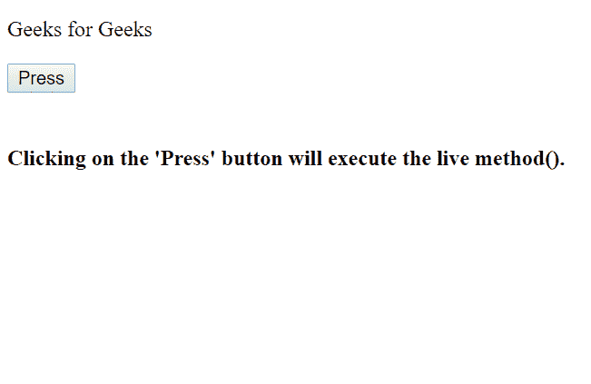
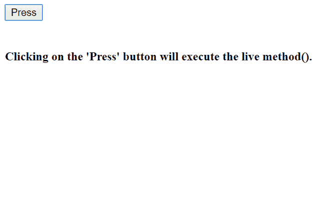
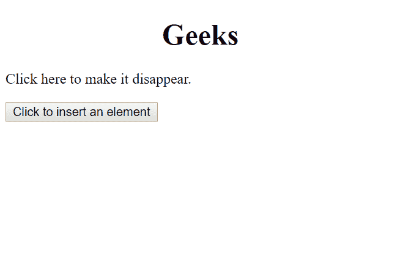
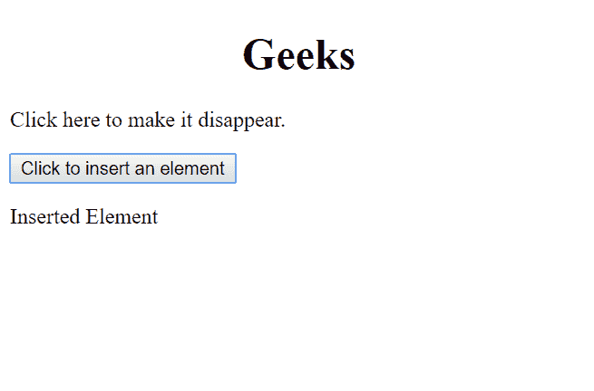
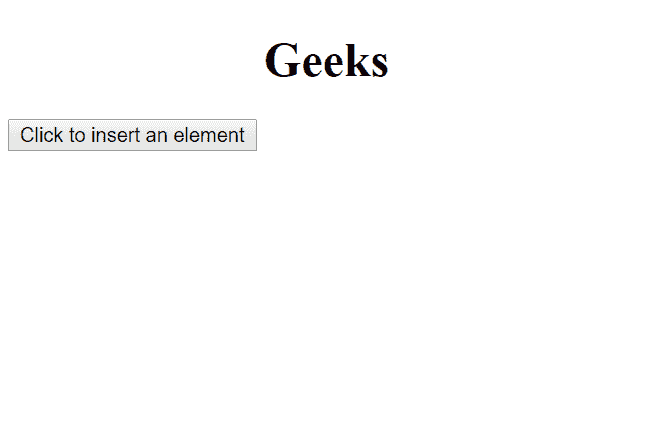

# jQuery | live()方法

> 原文:[https://www.geeksforgeeks.org/jquery-live-method/](https://www.geeksforgeeks.org/jquery-live-method/)

此方法用于为选定的元素附加一个或多个事件处理程序。它还指定了事件发生时运行的函数。所使用的事件处理程序将适用于当前和未来匹配选择器的元素。

**语法:**

```
$(selector).live(event, data, function)
```

**属性值:**

*   **事件:**用于指定事件，事件将附加到元素上。如果有一个以上的事件，那么它们被空间隔开。
*   **功能:**用于指定功能，该功能将在事件发生时运行。
*   **数据:**用于用函数指定附加数据传递。它是一个可选属性。

**示例-1:** 事件发生时显示和隐藏文本。

```
<!DOCTYPE html>
<html>

<head>
    <script src=
"https://ajax.googleapis.com/ajax/libs/jquery/1.7/jquery.min.js">
    </script>
    <script>
        $(document).ready(function() {
            $("button").live("click", function() {
                $("p").slideToggle();
            });
        });
    </script>
</head>

<body>

    <p>Geeks for Geeks</p>

    <button>Press</button>
    <br>
    <br>

    <div><b><h4>Clicking on the 'Press' 
      button will execute the live method().
      </h4></b> </div>
</body>

</html>
```

**输出:**

**点击按钮前:**


**点击按钮后:**


**示例-2:** 事件发生时插入元素并隐藏。

```
<!DOCTYPE html>
<html>

<body>
    <h1><center>Geeks
      </center>
  </h1>
    <script src=
"https://ajax.googleapis.com/ajax/libs/jquery/1.7/jquery.min.js">
    </script>
    <script>
        $(document).ready(function() {

            $("p").live("click", function() {
                $(this).slideToggle();
            });
            $("button").click(function() {
                $("<p>Inserted Element</p>").insertAfter(
                  "button");
            });
        });
    </script>
    <p>Click here to make it disappear.</p>
    <button>Click to insert an element</button>

</body>

</html>
```

**输出:**

**最初:**


**点击按钮前:**


**点击按钮后:**
