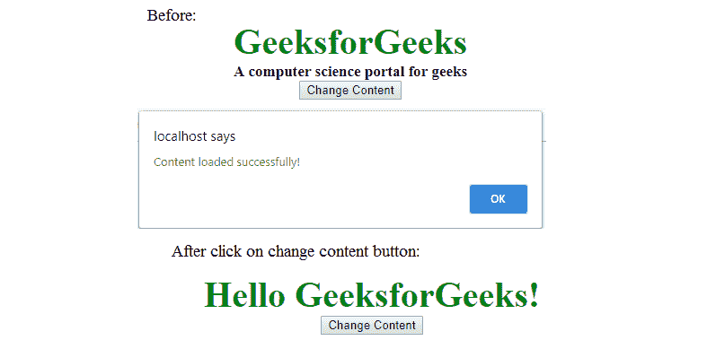

# jQuery | load()示例

> 原文:[https://www.geeksforgeeks.org/jquery-load-with-examples/](https://www.geeksforgeeks.org/jquery-load-with-examples/)

jQuery load()方法是一个简单但非常强大的 AJAX 方法。jQuery 中的 Load()方法有助于从服务器加载数据并返回到选定的元素中，而无需加载整个页面。

**语法:**

```html
$(selector).load(URL, data, callback);
```

**参数:**该方法接受三个参数，如上所述，如下所述:

*   **URL:** 用于指定需要加载的 URL。
*   **数据:**用于指定一组查询键/值对，随请求一起发送。
*   **回调:**是可选参数，是调用 load()方法后要执行的函数的名称。

**返回值:**该方法用指定的网址从服务器返回请求的数据。

**示例:**

> geeks.txt 文件存储在服务器上，它将在点击按钮后加载。极客. txt 的内容有:
> 你好极客 forGeeks！

**程序 1:**

```html
<!DOCTYPE html>
<html>
    <head>
        <script src=
        "https://ajax.googleapis.com/ajax/libs/jquery/3.3.1/jquery.min.js">
        </script>
        <script>
            $(document).ready(function(){
                $("button").click(function(){
                    $("#div_content").load("gfg.txt");
                });
            });
        </script>
        <style>
            body {
                text-align: center;
            }
            .gfg {
                font-size:40px;
                font-weight: bold;
                color: green;
            }
            .geeks {
                font-size:17px;
                color: black;
            }
            #div_content {
                font-size: 40px;
                font-weight: bold;
                color: green;
            }
        </style>
    </head>
    <body>
        <div id="div_content">
            <div class = "gfg">GeeksforGeeks</div>
            <div class = "geeks">A computer science portal for geeks</div>
        </div>
        <button>Change Content</button>
    </body>
</html>
```

**输出:**


参数中还有一个额外的回调函数，它将在 load()方法完成时运行。这个回调函数有三个不同的参数:

*   **参数 1:** 如果方法调用成功，则包含内容的结果。
*   **参数 2:** 包含调用函数的状态。
*   **参数 3:** 包含 XMLHttpRequest 对象。

**程序 2:**

```html
<html>
    <head>
        <script src=
        "https://ajax.googleapis.com/ajax/libs/jquery/3.3.1/jquery.min.js">
        </script>
        <script>
        $(document).ready(function(){
            $("button").click(function(){
                $("#div_content").load("gfg.txt", function(response,
                                                         status, http){
                    if(status == "success")
                        alert("Content loaded successfully!");
                    if(status == "error")
                        alert("Error: " + http.status + ": " 
                                                       + http.statusText);
                });
            });
        });
        </script>
        <style>
            body {
                text-align: center;
            }
            .gfg {
                font-size:40px;
                font-weight: bold;
                color: green;
            }
            .geeks {
                font-size:17px;
                color: black;
            }
            #div_content {
                font-size: 40px;
                font-weight: bold;
                color: green;
            }
        </style>
    </head>
    <body>
        <div id="div_content">
            <div class = "gfg">GeeksforGeeks</div>
            <div class = "geeks">A computer science portal for geeks</div>
        </div>
            <button>Change Content</button>
    </body>
</html>
```

**输出:**

输出给定的代码后会出现一个警告框，点击按钮后，如果内容加载成功，则会给出一条消息**“内容加载成功！”**。否则，它将显示一条错误消息。