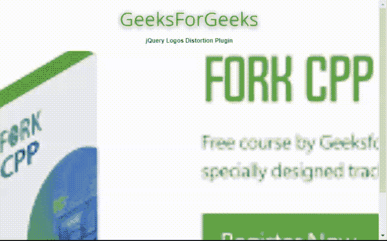
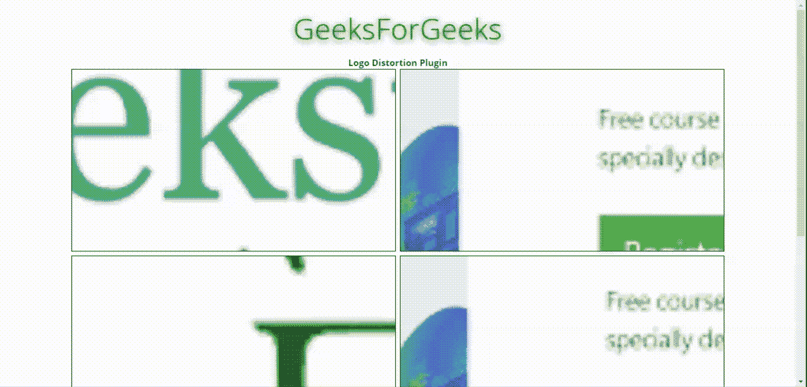
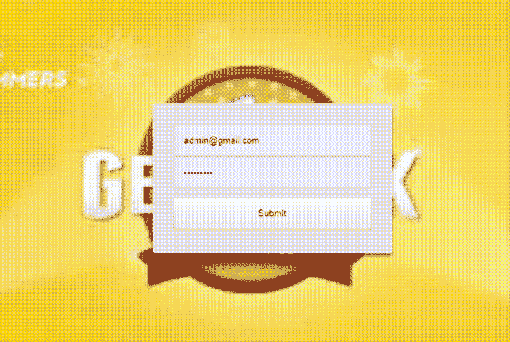

# jQuery |徽标扭曲插件

> 原文:[https://www.geeksforgeeks.org/jquery-logos-distort-plugin/](https://www.geeksforgeeks.org/jquery-logos-distort-plugin/)

jQuery 提供了**登录存储**插件，该插件有助于在用户浏览器中为 3D 场景创建视差环境或制作其动画。它使用整页 matrix3D 透视徽标变形来基于鼠标移动进行转换。

您必须在工作文件夹中下载所需的文件，以便程序员可以在 HTML 结构页面的标题部分中包含以下程序中实现的内容。
**下载链接:**https://github.com/hellsan631/LogosDistort

**示例 1:** 以下示例显示了插件的基本**logos stort()**方法。

```html
<!DOCTYPE html>
<html>
<head>
    <title>jQuery Logos Distortion Plugin</title>
    <meta name="viewport" 
          content="width=device-width, initial-scale=1.0">
    <link href="style.css" rel="stylesheet" />
    <link href="perspectiveRules.css" rel="stylesheet" />

    <script src=
"https://cdnjs.cloudflare.com/ajax/libs/jquery/2.1.4/jquery.min.js">
    </script>
    <script src="jquery.logosDistort.js"></script>
    <script src="jquery.particleground.min.js"></script>
</head>
<style>
  body{
    text-align:center;
    font-family:sans-serif;
    font-size:12px;
  }
</style>
<body>
  <h1 style="color:green">GeeksForGeeks</h1>
  <b>jQuery Logos Distortion Plugin </b>
  <p></p>
  <div id="imagesDivID">
      
      
      
  </div> 
  <script>
      $("#imagesDivID").logosDistort();
  </script>

</body>
</html>
```

**输出:**


**示例 2:** 以下示例显示了**登录存储()**方法的几个选项设置。程序员可以根据应用程序对视觉效果的要求来设置选项。

```html
<!DOCTYPE html>
<html>
<head>
    <title>jQuery Logos Perspective Distortion</title>
    <meta name="viewport" 
          content="width=device-width, initial-scale=1.0">
    <link href="style.css" rel="stylesheet" />
    <link href="perspectiveRules.css" rel="stylesheet" />
</head>
<body>
    <h1 style="color:green;">GeeksForGeeks</h1>
    <b>jQuery Logos distortion</b>

<div id="imagesDivID">
    
    
    <div></div>
    
    
    <div></div>
    <div></div>    
    
</div>

<script src=
"https://cdnjs.cloudflare.com/ajax/libs/jquery/2.1.4/jquery.min.js">
</script>
<script src="jquery.logosDistort.js"></script>
<script src="jquery.particleground.min.js"></script>
<script>
     var options = {
        enable: true,
        effectWeight: 2.5,
        outerBuffer: 1.30,
        elementDepth: 140,
        enableSmoothing: true,
        smoothingMultiplier: 1.5,
        perspectiveMulti: 1,
        directions: [ 1, 1, 1, 1, -1, -1, 1, 1 ],
        weights: [0.0000310, 0.0001800, 0.0000164, 0.0000019, 0.0001200],
        depthOverride: false,
        mouseMode: 'container'
    };
    $("#imagesDivID").logosDistort(options);
</script>
</body>
</html>
```

**输出:**


**示例 3:** 以下示例显示了在同一页面中显示的多张具有**logos stort**效果的卡片。

```html
<!DOCTYPE html>
<html>
<head>
    <title>Logos Perspective Distortion </title>
    <meta name="viewport"
          content="width=device-width, initial-scale=1.0">
    <link href="style.css" rel="stylesheet" />
    <link href="perspectiveRules.css" rel="stylesheet" />    

    <script src=
"https://cdnjs.cloudflare.com/ajax/libs/jquery/2.1.4/jquery.min.js">
    </script>
    <script src="jquery.logosDistort.js"></script>
    <script src="jquery.particleground.min.js"></script>
</head>
<style>
  body{
   text-align:center;
  }
  .containerDiv 
  {
    width: 100%;
  }
  .section {
    width: 550px;
    height: 310px;
    margin: 2px;
    border: 1px solid black;
    position: relative;
    display: inline-block;
  }
</style>
<body>
  <h1 style="color:green">GeeksForGeeks</h1>
  <b>Logo Distortion Plugin</b>
  <p></p>
  <div class="containerDiv">
    <div class="section">
        
               
    </div>
    <div class="section">
        
               
    </div>

    <div class="section">
        
        
    </div>
    <div class="section">
         
         
    </div>

    <div class="section">
         
         
    </div>
    <div class="section">
         
          
    </div>

  </div>

  <script>
      new logosDistort(
        document.getElementsByClassName('section'),
        {
          container: 'self',
          //This is new option
          perspectiveMulti: 1.2,
          mouseMode: 'container',
          outerBuffer: 2,
          effectWeight: 4
        }
      );
  </script>

</body>
</html>
```

**输出:**


**示例 4:** 以下示例为用户显示固定登录屏幕的扭曲背景。

```html
<!DOCTYPE html>
<html>
<head>
    <title>Logos Perspective Distortion </title>
    <meta name="viewport" 
          content="width=device-width, initial-scale=1.0">
    <link href="style.css" rel="stylesheet" />
    <link href="perspectiveRules.css" rel="stylesheet" />

   <script src=
"https://cdnjs.cloudflare.com/ajax/libs/jquery/2.1.4/jquery.min.js">
   </script>
   <script src="jquery.logosDistort.js"></script>
   <script src="jquery.particleground.min.js"></script>
</head>
<style>
  .loginClass 
  {
    position:absolute;
    top:0;
    left:0;
    z-index:3;
    width:100%;
    height:100%;   
  } 
  .login-inputs
  {
    position: absolute;   
    width: 350px;
    height: 220px;
    margin-top: -100px;
    margin-left: -150px;
    background:#e9e9e9;
    color:#333333;   
    border-radius: 3px;
    box-shadow: 0px 4px 4px rgba(0,0,0,0.5);
    padding: 30px;
    display: inline-block;  
  }
  input
  {
    width: 100%;
    height:30%
  }
  .login-controls
  {
    width:100%;
    position:absolute;
    top:50%;
    text-align:center;
    z-index:inherit;
  } 

</style>
<body>

  <div class="loginClass">
    <div class="login-controls">
      <div class="login-inputs">      
        <input type="text" placeholder="Email ID" /><br/>
        <input type="password" placeholder="Password" /><br/><br/>
    <input type="submit" placeholder="Login" />
      </div>
    </div>
  </div>

  <div id="logoDistortDivID">
       
            
  </div>  
  <script>
      var distort = new logosDistort(
        document.getElementById('logoDistortDivID'),
        {
          perspectiveMulti: 1.5
        }
      );
  </script>
</body>
</html>
```

**输出:**
