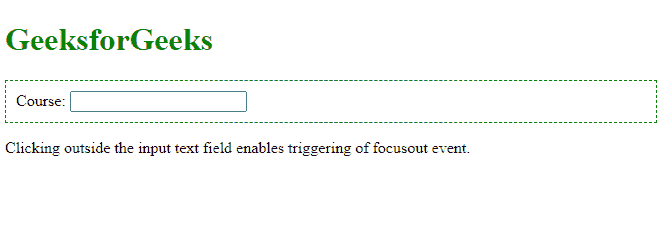
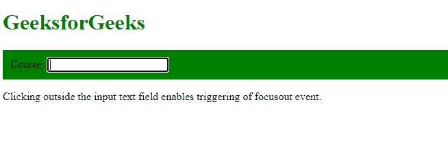
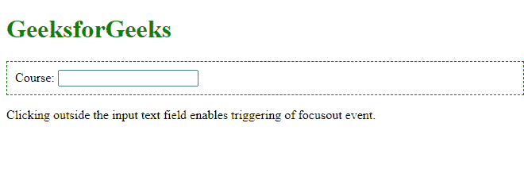
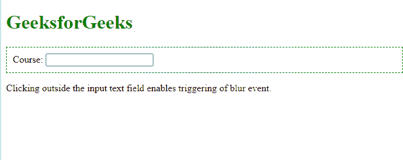
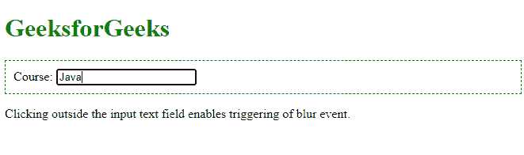
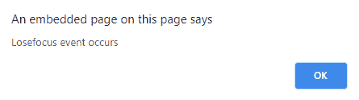

# jQuery 失焦事件

> 原文:[https://www.geeksforgeeks.org/jquery-lose-focus-event/](https://www.geeksforgeeks.org/jquery-lose-focus-event/)

失焦事件主要通过 focusout()和 blur()方法发生。当方法被触发时，它们都会失去焦点。这些事件彼此略有不同，但都是为了失去焦点。
Focusout()经常与 focusin()结合使用，blur()经常与 focus()结合使用。

请注意，focusout()方法也会在子元素失去焦点时被触发。

**语法:**

```html
$(selector).focusout(function)
```

**或**

```html
$(selector).blur(function)
```

这里，function 是参数，它是可选的，在 focusout()和 blur()方法被触发时发生。

**例 1:** 这个例子展示了使用 focusout()来失去焦点。

```html
<!DOCTYPE html>
<html>

<head>
    <script src=
"https://ajax.googleapis.com/ajax/libs/jquery/3.5.1/jquery.min.js">
    </script>

    <script>
        $(document).ready(function () {
            $("div").focusin(function () {
                $(this).css("background-color", "#008000");
            });
            $("div").focusout(function () {
                $(this).css("background-color", "#FFFFFF");
            });
        });
    </script>
</head>

<body>
    <h1 style="color:green;">
        GeeksforGeeks
    </h1>

    <div style="border: 1px dashed green;padding:10px;">
        Course: <input type="text"><br>
    </div>

    <p>
        Clicking outside the input text field enables 
        triggering of focusout event.
    </p>
</body>

</html>
```

**输出:**

*   **正常输出:**
    
*   **在输入文本字段内点击时:**
    
*   **在文本字段外点击，恢复正常:**
    

**示例 2:** 此示例显示了使用模糊()来失去焦点。

```html
<!DOCTYPE html>
<html>

<head>
    <script src=
"https://ajax.googleapis.com/ajax/libs/jquery/3.5.1/jquery.min.js">
    </script>

    <script>
        $(document).ready(function () {
            $("input").blur(function () {
                alert("Losefocus event occurs");
            });
        });
    </script>
</head>

<body>
    <h1 style="color:Green;">
        GeeksforGeeks
    </h1>

    <div style="border: 1px dashed green;padding:10px;">
        Course: <input type="text"><br>

    </div>

    <p>
        Clicking outside the input text field 
        enables triggering of blur event.
    </p>
</body>

</html>
```

**输出:**
**正常输出**

*   
*   **当点击输入文本字段**
    时
*   **在文本字段外点击，显示此弹出**
    