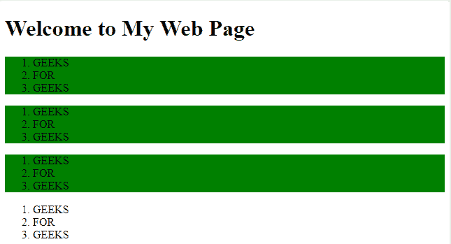

# jQuery | :lt()选择器

> 原文:[https://www.geeksforgeeks.org/jquery-lt-selector/](https://www.geeksforgeeks.org/jquery-lt-selector/)

**:lt()选择器**使用小于指定数值的索引号选择元素。索引号从 0 开始。

**语法:**

```
$(":lt(index)")
```

**参数:**

*   **索引:**选择的索引号。选择小于指定索引号的元素。

**示例:**

```
<!DOCTYPE html>
<html>

<head>
    <script src=
"https://ajax.googleapis.com/ajax/libs/jquery/3.3.1/jquery.min.js">
  </script>

  <script>
        $(document).ready(function() {

            $("ol:lt(3)").css(
              "background-color", "green");
        });
    </script>
</head>

<body>

    <h1>Welcome to My Web Page</h1>

    <ol id="1">
        <li>GEEKS</li>
        <li>FOR</li>
        <li>GEEKS</li>
    </ol>

    <ol id="2">
        <li>GEEKS</li>
        <li>FOR</li>
        <li>GEEKS</li>
    </ol>
    <ol id="3">
        <li>GEEKS</li>
        <li>FOR</li>
        <li>GEEKS</li>
    </ol>
    <ol id="4">
        <li>GEEKS</li>
        <li>FOR</li>
        <li>GEEKS</li>
    </ol>

</body>

</html>
```

**输出:**
