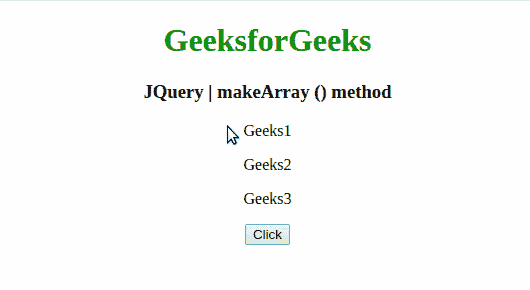
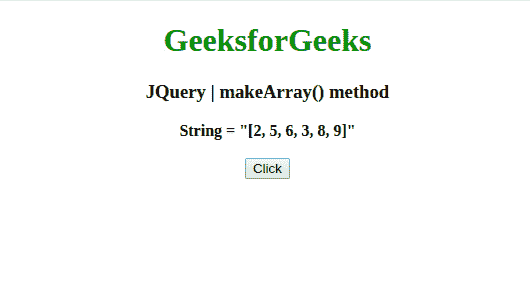

# JQuery | makeArray()方法

> 原文:[https://www.geeksforgeeks.org/jquery-makearray-method/](https://www.geeksforgeeks.org/jquery-makearray-method/)

jQuery 中的这个 **makeArray()** 方法是用来把一个类似数组的对象转换成一个真正的 JavaScript 数组。

**语法:**

```html
jQuery.makeArray( obj )
```

**参数:**该方法接受上面提到的和下面描述的单个参数:

*   **obj :** 此参数保存一个要转换为本机数组的对象。

**返回值:**返回数组。

下面的例子说明了在 jQuery 中使用**makarray()方法**:

**示例 1:** 本示例使用 **jQuery.makeArray()方法**并将一组 **HTMLElements** 转化为它们的数组。

```html
<!DOCTYPE html>
<html>

<head>
    <meta charset="utf-8">
    <title>JQuery | makeArray() method</title>
    <script src=
"https://code.jquery.com/jquery-3.4.1.js">
    </script>

</head>

<body style="text-align:center;">

    <h1 style="color: green"> 
        GeeksforGeeks 
    </h1>

    <h3>JQuery | makeArray () method</h3>
    <p>Geeks1</p>
    <p>Geeks2</p>
    <p>Geeks3</p>
    <button onclick="geek()">Click</button>
    <br>
    <br>
    <b id="root"></b>

    <script>
        function geek() {
            var elems = document.getElementsByTagName("p");
            var x = jQuery.makeArray(elems);
            var t = x[1];
            x[1] = x[2];
            x[2] = t;
            $(x).appendTo(document.body);
        }
    </script>
</body>

</html>
```

**输出:**


**示例 2:** 本示例使用**jquery . makerearray()方法**将一个类似数组的字符串转换为实际数组。

```html
<!DOCTYPE html>
<html>

<head>
    <meta charset="utf-8">
    <title>JQuery | makeArray() method</title>
    <script src=
"https://code.jquery.com/jquery-3.4.1.js">
    </script>

</head>

<body style="text-align:center;">

    <h1 style="color: green"> 
        GeeksforGeeks 
    </h1>

    <h3>JQuery | makeArray() method</h3>
    <b>String = "[2, 5, 6, 3, 8, 9]"</b>
    <br>
    <br>
    <button onclick="geek()">Click</button>
    <br>
    <br>
    <b id="root"></b>

    <script>
        function geek() {
            var el = document.getElementById('root');
            var arr = "[2, 5, 6, 3, 8, 9]";

            var newArr = jQuery.makeArray(arr)
            el.innerHTML = jQuery.type(newArr) + " = " + newArr;
        }
    </script>
</body>

</html>                   
```

**输出:**
