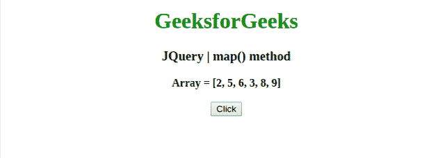
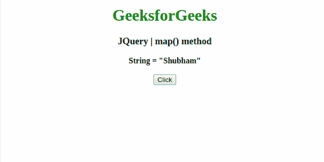

# JQuery | map()方法

> 原文:[https://www.geeksforgeeks.org/jquery-map-method/](https://www.geeksforgeeks.org/jquery-map-method/)

jQuery 中的这个**映射()**方法用于将一个数组或对象中的所有项翻译成新的项数组。

**语法:**

```
jQuery.map( array/object, callback )
```

**参数:**该方法接受上面提到的和下面描述的两个参数:

*   **数组/对象:**此参数保存要翻译的数组或对象。
*   **回调:**该参数保存处理每个项目的函数。

**返回值:**返回数组。

以下示例说明了在 jQuery 中使用 **map()方法**:

**例 1:** 本例使用 **jQuery.map()方法**并返回数组元素的平方。

```
<!DOCTYPE html>
<html>

<head>
    <meta charset="utf-8">
    <title>JQuery | map() method</title>
    <script src=
"https://code.jquery.com/jquery-3.4.1.js">
    </script>

</head>

<body style="text-align:center;">

    <h1 style="color: green"> 
        GeeksforGeeks 
    </h1>

    <h3>JQuery | map() method</h3>
    <b>Array = [2, 5, 6, 3, 8, 9]</b>
    <br>
    <br>
    <button onclick="geek()">Click</button>
    <br>
    <br>
    <b id="root"></b>

    <script>
        function geek() {
            var el = document.getElementById('root');
            var arr = [2, 5, 6, 3, 8, 9];

            var newArr = jQuery.map(arr, function(val, index) {
                return {
                    number: val,
                    square: val * val
                };
            })
            el.innerHTML = JSON.stringify(newArr);
        }
    </script>
</body>

</html>
```

**输出:**


**示例 2:** 本示例使用 **map()方法**将字符“A”与名称的每个字符连接起来。

```
<!DOCTYPE html>
<html>

<head>
    <meta charset="utf-8">
    <title>JQuery | map() method</title>
    <script src=
"https://code.jquery.com/jquery-3.4.1.js">
    </script>

</head>

<body style="text-align:center;">

    <h1 style="color: green"> 
        GeeksforGeeks 
    </h1>

    <h3>JQuery | map() method</h3>
    <b>String = "Shubham"</b>
    <br>
    <br>
    <button onclick="geek()">Click</button>
    <br>
    <br>
    <b id="root"></b>

    <script>
        function geek() {
            var el = document.getElementById('root');
            var name = "Shubham";
            name = name.split("");

            // New array of character and names  
            // concatenated with 'A'  
            var newName = jQuery.map(name, function(item) {
                return item + 'A<br>';
            })
            el.innerHTML = newName;
        }
    </script>
</body>

</html>                     
```

**输出:**
