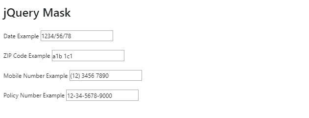

# jQuery | Mask Plugin

> 哎哎哎:# t0]https://www . geeksforgeeks . org/jquery-mask 外挂程式/

jQuery 遮罩是一个 jQuery 插件，它帮助在基本的 HTML 输入字段和其他元素上添加一个遮罩。如果开发人员希望输入字段只接受特定格式的输入，那么他们可以使用 jQuery 屏蔽插件。这种类型的功能也可以使用像 PHP 这样的后端语言来创建。然而，如果在前端处理，时间和内存效率会高得多。

例如，假设开发人员希望用户以 **(xxx)-xxx-xxxx** 的格式输入他们的 10 位数手机号码。他们可以使用 jQuery Mask 指定这种格式，输入框字段将自动采用定义的格式显示数字。开发人员所要做的就是使用 jQuery 选择器 **$** 选择合适的输入框，然后使用 mask()功能指定所需的格式。

**遮罩过渡:**默认可用的遮罩过渡为:

*   **“0”:{ pattern:/\ d/}**
*   **“A”:{ pattern:/[A-zA-Z0-9]/}**
*   **“9”:{ pattern:/\ d/，可选:true}**
*   **'S': {pattern: /[a-zA-Z]/}**
*   **'#': {pattern: /\d/，递归:true}**

**CDN 链接**

```
<script src="https://cdnjs.cloudflare.com/ajax/libs/jquery.mask/1.14.16/jquery.mask.js" 
        integrity="sha256-yE5LLp5HSQ/z+hJeCqkz9hdjNkk1jaiGG0tDCraumnA=" 
        crossorigin="anonymous"
></script>

```

该链接必须包含在索引页面中，才能使 jQuery 掩码功能发挥作用。

**示例:**

```
<!Doctype html>
<html lang="en">

<head>

    <!-- Required meta tags -->
    <meta charset="utf-8">
    <meta name="viewport"
        content="width=device-width,
                initial-scale=1,
                shrink-to-fit=no">

    <!-- Bootstrap CSS -->
    <link rel="stylesheet" href=
"https://stackpath.bootstrapcdn.com/bootstrap/4.3.1/css/bootstrap.min.css"
        integrity=
"sha384-ggOyR0iXCbMQv3Xipma34MD+dH/1fQ784/j6cY/iJTQUOhcWr7x9JvoRxT2MZw1T"
        crossorigin="anonymous">

    <!-- jQuery first, then Popper.js, then Bootstrap JS -->
    <script src="https://code.jquery.com/jquery-3.3.1.slim.min.js"
            integrity=
"sha384-q8i/X+965DzO0rT7abK41JStQIAqVgRVzpbzo5smXKp4YfRvH+8abtTE1Pi6jizo"
            crossorigin="anonymous">
    </script>

    <script src=
"https://cdnjs.cloudflare.com/ajax/libs/jquery.mask/1.14.16/jquery.mask.js"
            integrity=
"sha256-yE5LLp5HSQ/z+hJeCqkz9hdjNkk1jaiGG0tDCraumnA="
            crossorigin="anonymous">
    </script>

    <script src=
"https://cdnjs.cloudflare.com/ajax/libs/popper.js/1.14.7/umd/popper.min.js"
            integrity=
"sha384-UO2eT0CpHqdSJQ6hJty5KVphtPhzWj9WO1clHTMGa3JDZwrnQq4sF86dIHNDz0W1"
            crossorigin="anonymous">
    </script>

    <script src=
"https://stackpath.bootstrapcdn.com/bootstrap/4.3.1/js/bootstrap.min.js"
            integrity=
"sha384-JjSmVgyd0p3pXB1rRibZUAYoIIy6OrQ6VrjIEaFf/nJGzIxFDsf4x0xIM+B07jRM"
            crossorigin="anonymous">
    </script>

    <style>
        body {
            padding: 2%;
        }
    </style>
</head>

<body>
    <h2>jQuery Mask</h2>
    <br>

    <p>
        <label>
            Date Example
            <input type="text"
                name="date" />
        </label>
    </p>

    <p>
        <label>
            ZIP Code Example
            <input type="text"
                name="zip-code" />
        </label>
    </p>

    <p>
        <label>
            Mobile Number Example
            <input type="text"
                name="mobile-number" />
        </label>
    </p>

    <p>
        <label>
            Policy Number Example
            <input type="text"
                name="policy-number"
                data-mask="00-00-0000-0000" />
        </label>
    </p>

    <script>
        $('input[name="date"]').mask('0000/00/00');
        $('input[name="zip-code"]').mask('S0S 0S0');
        $('input[name="mobile-number"]').mask('(00) 0000 0000');
        $('input[name="postal-code"]').focusout(function() {
            $('input[name="postal-code"]').val(this.value.toUpperCase());
        });
    </script>
</body>

</html>
```

**输出**


**说明:**

*   **日期:**在上面的源代码中，可以看到日期的输入格式被指定为 **0000/00/00** 。现在，用户输入日期数字，输入字段将自动采用指定格式的数字。
*   **邮政编码:**邮政编码同样指定的格式为 **S0S 0S0** 。之后，创建一个函数，自动将所有输入的小写值更改为大写格式。
*   **手机号码:**指定格式为 **(00) 0000 0000** 。一旦用户开始输入手机号码，小括号和适当的间距将自动应用。
*   **策略号:**指定的内嵌 HTML 格式为 **00-00-0000-0000** 。策略编号会以此指定格式自动输入。