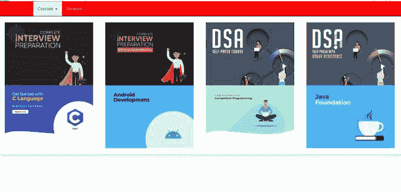
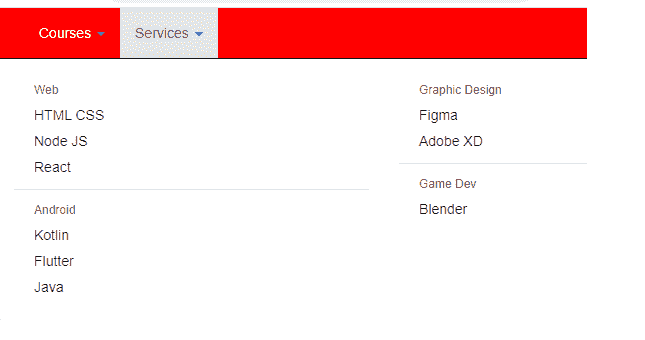

# jquery mega drop . js

> 哎哎哎:# t0]https://www . geeksforgeeks . org/jquery-mega drop js/

**megabdown . js**是一个 jQuery 插件，用于下拉菜单的轻松实现。我们可以使用 megadropdown.js 轻松创建响应性下拉菜单。

我们可以使用这个插件将标准的 HTML 嵌套列表变成水平的大菜单。

其特点如下:

*   我们可以添加动画效果，如淡入或向下滑动来显示子菜单。
*   我们可以选择在大菜单的每一行上显示的子菜单项的数量
*   有了一些基本的 CSS 样式，它可以用来为任何网站创建独特的和视觉上吸引人的导航。

**CDN 链接:**要使用这个插件，只需添加 CDN 链接。

> <src 脚本= " https://maxcdn . bootstracdn . com/bootstrap cdn/3 . 3 . 7/js/bootstrap . min . js "></script><src 脚本= " https://cdnjs . cloudflare . com/Ajax/libs

**示例:**

## 超文本标记语言

```html
<!DOCTYPE html>
<html lang="en" class="no-js">
    <head>
        <meta charset="UTF-8" />
        <meta name="viewport" 
              content="width=device-width, initial-scale=1" />
        <link rel="stylesheet" 
              href=
"https://maxcdn.bootstrapcdn.com/bootstrap/3.3.7/css/bootstrap.min.css" />

        <script src=
"https://ajax.googleapis.com/ajax/libs/jquery/1.12.4/jquery.min.js">
        </script>
        <script src=
"https://maxcdn.bootstrapcdn.com/bootstrap/3.3.7/js/bootstrap.min.js">
        </script>
        <script src=
"https://cdnjs.cloudflare.com/ajax/libs/mmenu-js/8.5.22/mmenu.js">
        </script>
        <style>
            .navbar-brand > img {
                padding-top: 11px;
                width: 130px;
                margin-left: 60px;
            }
            .navbar-brand {
                height: auto;
                margin: 0;
                padding: 0;
                margin-right: 20px;
            }
            .navbar-default {
                color: #fff;
                background-color: red;
                border-color: #000000;
            }
            .navbar-default .navbar-nav > li > a {
                color: #fff;
            }
            .navbar-default .navbar-nav > .dropdown > a .caret {
                border-top-color: blue;
                border-bottom-color: #fff;
            }
            .navbar-default .navbar-brand {
                color: #fff;
            }
            .menu-large {
                position: static !important;
            }
            .megamenu {
                padding: 20px 0px;
                width: 100%;
            }
            .megamenu > li > ul {
                padding: 0;
                margin: 0;
            }
            .megamenu > li > ul > li {
                list-style: none;
            }
            .megamenu > li > ul > li > a {
                display: block;
                padding: 3px 20px;
                clear: both;
                font-weight: normal;
                line-height: 1.428571429;
                color: #333333;
                white-space: normal;
            }
            .megamenu > li ul > li > a:hover,
            .megamenu > li ul > li > a:focus {
                text-decoration: none;
                color: #262626;
                background-color: #f5f5f5;
            }
            .megamenu.disabled > a,
            .megamenu.disabled > a:hover,
            .megamenu.disabled > a:focus {
                color: #999999;
            }
            .navbar-default .navbar-nav > li > a:focus,
            .navbar-default .navbar-nav > li > a:hover {
                color: #00a7e8;
            }
            .megamenu.disabled > a:hover,
            .megamenu.disabled > a:focus {
                text-decoration: none;
                background-color: transparent;
                background-image: none;
                filter: progid:DXImageTransform.Microsoft.gradient(enabled = false);
                cursor: not-allowed;
            }
            .megamenu.dropdown-header {
                color: #428bca;
                font-size: 18px;
            }
            @media (max-width: 768px) {
                .megamenu {
                    margin-left: 0;
                    margin-right: 0;
                }
                .megamenu > li {
                    margin-bottom: 30px;
                }
                .megamenu > li:last-child {
                    margin-bottom: 0;
                }
                .megamenu.dropdown-header {
                    padding: 3px 15px !important;
                }
                .navbar-nav .open .dropdown-menu .dropdown-header {
                    color: #fff;
                }
            }
        </style>
    </head>
    <body>
        <div class="navbar navbar-default navbar-static-top">
            <div class="container">
                <div class="navbar-header">
                    <button type="button" 
                            class="navbar-toggle" 
                            data-toggle="collapse" 
                            data-target=".navbar-collapse">
                        <span class="icon-bar"></span>
                        <span class="icon-bar"></span>
                        <span class="icon-bar"></span>
                    </button>
                </div>
                <div class="navbar-collapse collapse">
                    <ul class="nav navbar-nav">
                        <li class="dropdown menu-large">
                            <a href="#" class="dropdown-toggle" 
                               data-toggle="dropdown"> 
                                Courses  </a>
                            <ul class="dropdown-menu megamenu row">
                                <li>
                                    <div class="col-sm-6 col-md-3">
                                        <a href="#" class="photo">
                                            
                                        </a>
                                    </div>
                                    <div class="col-sm-6 col-md-3">
                                        <a href="#" class="photo">
                                            
                                        </a>
                                    </div>
                                    <div class="col-sm-6 col-md-3">
                                        <a href="#" class="photo">
                                            
                                        </a>
                                    </div>
                                    <div class="col-sm-6 col-md-3">
                                        <a href="#" class="photo">
                                            
                                        </a>
                                    </div>
                                    <div class="col-sm-6 col-md-3">
                                        <a href="#" class="photo">
                                            
                                        </a>
                                    </div>
                                    <div class="col-sm-6 col-md-3">
                                        <a href="#" class="photo">
                                            
                                        </a>
                                    </div>
                                    <div class="col-sm-6 col-md-3">
                                        <a href="#" class="photo">
                                            
                                        </a>
                                    </div>
                                    <div class="col-sm-6 col-md-3">
                                        <a href="#" class="photo">
                                            
                                        </a>
                                    </div>
                                </li>
                            </ul>
                        </li>

                        <li class="dropdown menu-large">
                            <a href="#" class="dropdown-toggle"
                            data-toggle="dropdown">
                            Services <b class="caret"></b></a>
                            <ul class="dropdown-menu megamenu row">
                                <li class="col-sm-6">
                                    <ul>
                                        <li class="dropdown-header">
                                            Web
                                        </li>
                                        <li><a href="#">
                                            HTML CSS
                                            </a>
                                        </li>
                                        <li class="disabled"><a href="#">
                                            Node JS
                                            </a>
                                        </li>
                                        <li><a href="#">
                                            React
                                            </a>
                                        </li>
                                        <li class="divider"></li>
                                        <li class="dropdown-header">
                                            Andriod
                                        </li>
                                        <li><a href="#">
                                            Kotlin
                                            </a>
                                        </li>
                                        <li><a href="#">
                                            Flutter
                                            </a>
                                        </li>
                                        <li><a href="#">
                                            Java
                                            </a>
                                        </li>
                                    </ul>
                                </li>
                                <li class="col-sm-6">
                                    <ul>
                                        <li class="dropdown-header">
                                        Graphic Design
                                        </li>
                                        <li><a href="#">
                                        Figma</a>
                                        </li>
                                        <li><a href="#">
                                        Adobe XD</a>
                                        </li>
                                        <li class="divider"></li>
                                        <li class="dropdown-header">
                                        Game Dev
                                        </li>
                                        <li><a href="#">
                                        Blender</a>
                                        </li>
                                    </ul>
                                </li>
                            </ul>
                        </li>
                    </ul>
                </div>
            </div>
        </div>

        <script>
            // Javascript to use megadropdown.js
            $(document).ready(function() {
            jQuery(document).ready(function(){
                $(".dropdown").hover(
                    function() { $('.dropdown-menu', this)
                                    .stop().fadeIn("fast");
                    },
                    function() { $('.dropdown-menu', this)
                                    .stop().fadeOut("fast");
                });
            });
            }
        </script>
    </body>
</html>                 
```

**输出:**

*   **点击课程菜单:**

    课程菜单

*   ** On click of Services menu: **

    服务菜单

    /li>