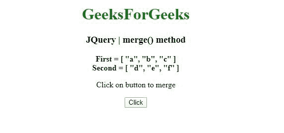
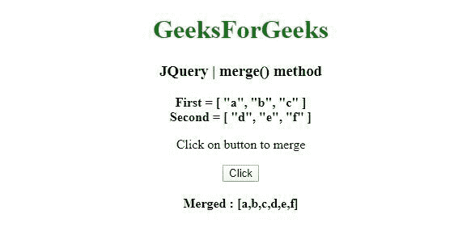
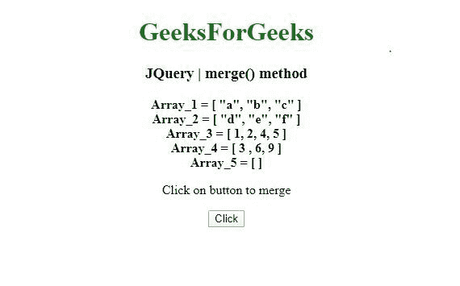
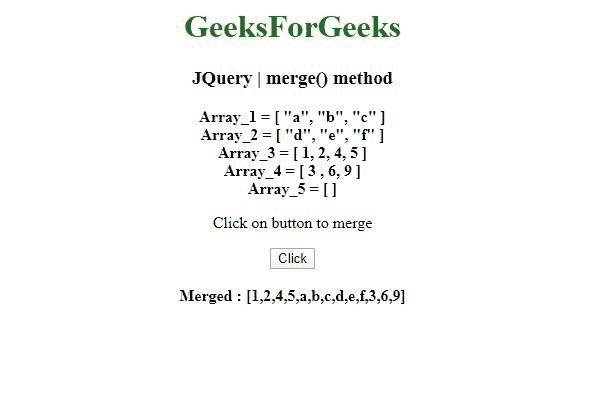

# JQuery | merge()方法

> 原文:[https://www.geeksforgeeks.org/jquery-merge-method/](https://www.geeksforgeeks.org/jquery-merge-method/)

jQuery 中的这个 **merge()** 方法用于将两个数组的内容合并到第一个数组中。

**语法:**

```
jQuery.merge( first, second )

```

**参数:**merge()方法只接受上面提到的一个参数，如下所述:

*   **第一个:**这个参数是第一个要合并的类数组对象，第二个的元素被添加。
*   **second :** This parameter is the second array-like object to merge into the first, unaltered.

    **返回值:**返回合并后的数组。

    **例 1:** 在本例中， **merge()方法**只合并了两个数组。

    ```
    <!DOCTYPE html>
    <html>
    <head>
    <meta charset="utf-8">
    <title>JQuery | merge() method</title> 
    <script src="https://code.jquery.com/jquery-3.4.1.js"></script>

    </head>
    <body style="text-align:center;"> 

        <h1 style="color: green"> 
            GeeksForGeeks 
        </h1> 

        <h3>JQuery | merge() method</h3>

        <b>First = [ "a", "b", "c" ]</b><br>
        <b>Second = [ "d", "e", "f" ]</b>
        <br>
        <p>Click on button to merge</p>
        <button onclick="geek()">Click</button>
        <br><br>
        <b id="geeks"></b>

        <script>
        function geek() {
            var first = [ "a", "b", "c" ];
            var second = [ "d", "e", "f" ];
            var n = $.merge(first, second );
            document.getElementById("geeks").innerHTML = "Merged : [" + n + "]";
        }
        </script>
    </body>
    </html>                                                                                                    
    ```

    **输出:**
    **点击前:**
    
    **点击后:**
    

    **例 2:** 在本例中，**合并()方法**合并了两个以上的数组。

    ```
    <!DOCTYPE html>
    <html>
    <head>
    <meta charset="utf-8">
    <title>JQuery | merge() method</title> 
    <script src="https://code.jquery.com/jquery-3.4.1.js"></script>

    </head>
    <body style="text-align:center;"> 

        <h1 style="color: green"> 
            GeeksForGeeks 
        </h1> 

        <h3>JQuery | merge() method</h3>

        <b>Array_1 = [ "a", "b", "c" ]</b><br>
        <b>Array_2 = [ "d", "e", "f" ]</b>    <br>
        <b>Array_3 = [ 1, 2, 4, 5 ]</b>    <br>
        <b>Array_4 = [ 3, 6, 9 ]</b><br>
        <b>Array_5 = [ ]</b>
        <br>
        <p>Click on button to merge</p>
        <button onclick="geek()">Click</button>
        <br><br>
        <b id="geeks"></b>

        <script>
        function geek() {
            var fi = [ "a", "b", "c" ];
            var se = [ "d", "e", "f" ];
            var th = [ 1, 2, 4, 5 ];
            var fo = [ 3, 6, 9 ];
            var fif = [];
            var n = $.merge(
    th, $.merge($.merge(fif, $.merge(fi, se )), fo));

            document.getElementById(
    "geeks").innerHTML = "Merged : [" + n + "]";
        }
        </script>
    </body>
    </html>                                                
    ```

    **输出:**
    **点击前:**
    
    **点击后:**
    