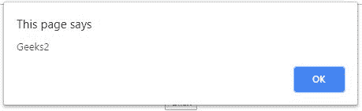
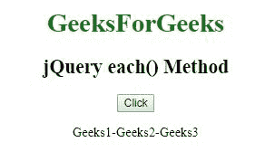

# jQuery | Misc 各()方法

> 原文:[https://www.geeksforgeeks.org/jquery-misc-each-method/](https://www.geeksforgeeks.org/jquery-misc-each-method/)

jQuery 中的**每()方法**用于为每个匹配的元素指定要运行的函数。

**语法:**

```
$(selector).each(function(index, element))
```

**参数:**该方法接受单参数**函数(指数、元素)**，为必选项。它用于运行每个匹配的元素。它包含两个参数。

*   **索引:**保存选择器元素的索引位置。
*   **元素:**保存当前元素。

**示例 1:** 本示例使用每个()方法显示每个段落元素。

```
<!DOCTYPE html>
<html>

<head> 
    <title>
        jQuery Misc each() Method
    </title>

    <script src=
"https://ajax.googleapis.com/ajax/libs/jquery/3.3.1/jquery.min.js">
    </script>
</head> 

<body style="text-align:center;">

    <h1 style = "color:green;" >  
        GeeksForGeeks
    </h1>  

    <h2>jQuery each() Method</h2>

    <button>Click</button>

    <p>Geeks1</p>
    <p>Geeks2</p>
    <p>Geeks3</p>

    <!-- Script use each() method -->
    <script>
        $(document).ready(function() {
            $("button").click(function() {
                $("p").each(function() {
                    alert($(this).text())
                });
            });
        });
    </script>
</body>

</html>  
```

**输出:**

*   **之前点击**
    按钮
*   **点击按钮后**
    
    
    

**示例 2:** 本示例使用每个()方法显示段落元素。

```
<!DOCTYPE html>
<html>

<head> 
    <title>
        jQuery Misc each() Method
    </title>

    <script src=
"https://ajax.googleapis.com/ajax/libs/jquery/3.3.1/jquery.min.js">
    </script>
</head> 

<body style="text-align:center;">

    <h1 style = "color:green;" >  
        GeeksForGeeks
    </h1>  

    <h2>jQuery each() Method</h2>

    <button>Click</button>

    <p>Geeks1-Geeks2-Geeks3</p>

    <div style="color:lightgreen;"></div>

    <!-- Script use each() method -->
    <script>
        $(document).ready(function(){
            $("button").click(function(){
                $("p").each(function(){
                    $("div").text($(this).text())
                });
            });
        });
    </script>
 </body>

</html>  
```

**输出:**

*   **之前点击按钮**
    *   **点击按钮后**
    