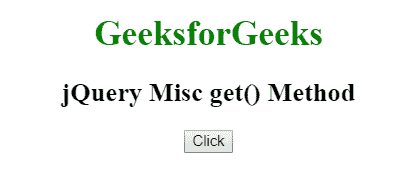
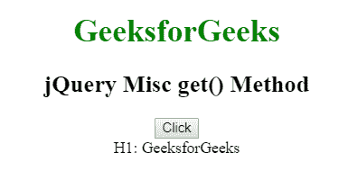
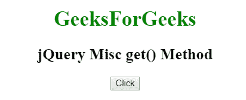
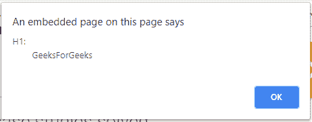

# jQuery | Misc get()方法

> 原文:[https://www.geeksforgeeks.org/jquery-misc-get-method/](https://www.geeksforgeeks.org/jquery-misc-get-method/)

jQuery 中的 **get()方法**用于获取选择器指定的 DOM 元素。

**语法**

```
$(selector).get(index)
```

**参数:**此方法接受单参数**指标**，可选。它用于通过索引号指定要获取的匹配元素。

**示例 1:** 本示例使用 get()方法获取选择器指定的元素。

```
<!DOCTYPE html>
<html>

<head> 
    <title>
        jQuery Misc get() Method
    </title>

    <script src=
"https://ajax.googleapis.com/ajax/libs/jquery/3.3.1/jquery.min.js">
    </script>
</head> 

<body style="text-align:center;">

    <h1 style = "color:green;" >  
        GeeksforGeeks
    </h1>  

    <h2>jQuery Misc get() Method</h2>

    <button>Click</button>

    <div></div>

    <script>
        $(document).ready(function() {
            $("button").click(function() {
                var x = $("h1").get(0);
                $("div").text(x.nodeName + ": " + x.innerHTML);
            });
        });
    </script> 
</body>

</html>  
```

**输出:**
**点击按钮前:**

**点击按钮后:**


**示例 2:** 本示例使用 get()方法获取选择器指定的元素。

```
<!DOCTYPE html>
<html>

<head> 
    <title>
        jQuery Misc get() Method
    </title>

    <script src=
"https://ajax.googleapis.com/ajax/libs/jquery/3.3.1/jquery.min.js">
    </script>
</head> 

<body style="text-align:center;">

    <h1 style = "color:green;" >  
        GeeksForGeeks
    </h1>  

    <h2>jQuery Misc get() Method</h2>

    <button>Click</button>

    <!-- Script to use get() method -->
    <script>
        $(document).ready(function(){
            $("button").click(function(){
                var x = $("h1").get(0);
                alert(x.nodeName + ": " + x.innerHTML);
            });
        });
    </script> 
</body>

</html>  
```

**输出:**
**点击按钮前:**

**点击按钮后:**
