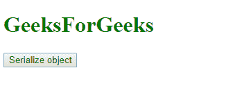
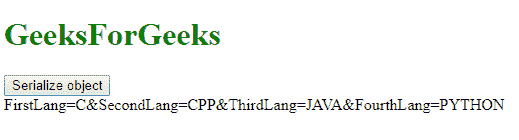

# jQuery | Misc param()方法

> 原文:[https://www.geeksforgeeks.org/jquery-misc-param-method/](https://www.geeksforgeeks.org/jquery-misc-param-method/)

jQuery 中的 **param()方法**用于创建数组或对象的表示。这种表示是以序列化方式创建的。这个序列化的值可以用于在 URL 中发出 ajax 请求。

**语法:**

```html
$.param(object, trad)
```

**参数:**

*   **对象:**指定要序列化的数组或对象。
*   **trad:** 一个布尔值，指定是否使用传统的参数序列化方式。

**示例:**

```html
<!DOCTYPE html>
<html>

<head>
    <script src=
"https://ajax.googleapis.com/ajax/libs/jquery/3.3.1/jquery.min.js">
  </script>

  <script>
        $(document).ready(function() {
            GFGlang = new Object();
            GFGlang.FirstLang = "C";
            GFGlang.SecondLang = "CPP";
            GFGlang.ThirdLang = "JAVA";
            GFGlang.FourthLang = "PYTHON";

            $("button").click(function() {
                $("div").text($.param(GFGlang));
            });
        });
    </script>
</head>

<body>
    <h1 style="color:green;"> 
                GeeksForGeeks 
            </h1>
    <button>
      Serialize object
  </button>

    <div></div>

</body>

</html>
```

**输出:**
**点击前:**


**点击后:**
