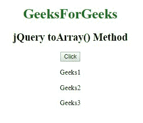
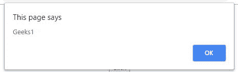
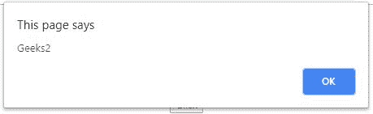
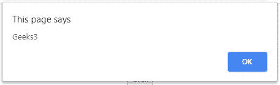
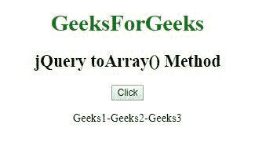
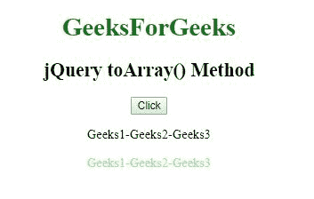

# jQuery | Misc toArray()方法

> 原文:[https://www.geeksforgeeks.org/jquery-misc-toarray-method/](https://www.geeksforgeeks.org/jquery-misc-toarray-method/)

jQuery 中的 **toArray()方法**用于将 jQuery 选择器匹配的元素作为数组返回。

**语法**

```
$(selector).toArray()
```

**参数:**此方法不接受任何参数。

**例 1:** 该方法使用 toArray()方法以数组的形式显示段落。

```
<!DOCTYPE html>
<html>

<head> 
    <title>
        jQuery Misc toArray() Method
    </title>

    <script src=
"https://ajax.googleapis.com/ajax/libs/jquery/3.3.1/jquery.min.js">
    </script>
</head> 

<body style="text-align:center;">

    <h1 style = "color:green;" >  
        GeeksForGeeks
    </h1>  

    <h2>jQuery Misc toArray() Method</h2>

    <button>Click</button>

    <p>Geeks1</p>
    <p>Geeks2</p>
    <p>Geeks3</p>

    <!-- Script to use toArray() method -->
    <script>
        $(document).ready(function() {
            $("button").click(function() {
                var i;
                var x = $("p").toArray()
                for (i = 0; i< x.length; i++) {
                    alert(x[i].innerHTML);
                }
            });
        });
    </script>
</body>

</html>  
```

**输出:**

*   **之前点击按钮:**
    
*   **点击按钮后:**
    
    
    

**示例 2:** 本示例使用 toArray()方法显示数组元素。

```
<!DOCTYPE html>
<html>

<head> 
    <title>
        jQuery Misc toArray() Method
    </title>

    <script src=
"https://ajax.googleapis.com/ajax/libs/jquery/3.3.1/jquery.min.js">
    </script>
</head> 

<body style="text-align:center">

    <h1 style="color:green;">  
        GeeksForGeeks
    </h1>  

    <h2>jQuery Misc toArray() Method</h2>

    <button>Click</button>

    <p>Geeks1-Geeks2-Geeks3</p>

    <div style="color:lightgreen;"></div>

    <!-- This example use toArray() method -->
    <script>
        $(document).ready(function(){
            $("button").click(function(){
                var i;
                var x = $("p").toArray()
                for (i = 0; i< x.length; i++) {
                    $("div").text(x[i].innerHTML);
                }
            });
        });
    </script>
</body>

</html>  
```

**输出:**

*   **之前点击按钮:**
    
*   **点击按钮后:**
    