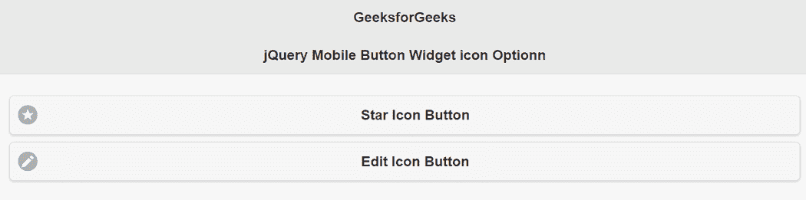

# jQuery 移动按钮小部件图标选项

> 原文:[https://www . geesforgeks . org/jquery-mobile-button-widget-icon-option/](https://www.geeksforgeeks.org/jquery-mobile-button-widget-icon-option/)

jQuery Mobile 是一种基于网络的技术，用于制作可在所有智能手机、平板电脑和台式机上访问的响应内容。在本文中，我们将使用 jQuery 移动按钮小部件图标选项在按钮内添加图标。

**语法:**

```html
$("selector").button({
   icon: "icon_name"
});
```

**CDN 链接:**首先，添加项目所需的 jQuery Mobile 脚本。

> <link rel="”stylesheet”" href="”//code.jquery.com/mobile/1.4.5/jquery.mobile-1.4.5.min.css”">
> <脚本 src =//code . jquery . com/jquery-1 . 10 . 2 . min . js”></脚本>
> <脚本 src =//code . jquery . com/mobile/1 . 4 . 5/jquery . mobile-1 . 4 . 5 . min . js”></脚本>

**示例:**

## 超文本标记语言

```html
<!doctype html>
<html lang="en">

<head>
    <meta charset="utf-8">
    <meta name="viewport" content=
        "width=device-width, initial-scale=1">

    <link rel="stylesheet" href=
"//code.jquery.com/mobile/1.4.5/jquery.mobile-1.4.5.min.css">

    <script src="//code.jquery.com/jquery-1.10.2.min.js">
    </script>

    <script src=
"//code.jquery.com/mobile/1.4.5/jquery.mobile-1.4.5.min.js">
    </script>

    <script>
        $(document).ready(function () {
            $(".gfg").button({
                icon: "star"
            });

            $(".gfg1").button({
                icon: "edit"
            });
        });
    </script>
</head>

<body>
    <div data-role="page" id="page1">
        <div data-role="header">
            <h1>GeeksforGeeks</h1>
            <h3>jQuery Mobile Button Widget icon Optionn</h3>
        </div>
        <div role="main" class="ui-content">
            <form action="#" method="get">
                <input type="submit" 
                    value="Star Icon Button" class="gfg">

                <input type="button" 
                    value="Edit Icon Button" class="gfg1">
            </form>
        </div>
    </div>
</body>

</html>
```

**输出:**



**参考:**T2】https://api.jquerymobile.com/1.4/button/#option-icon