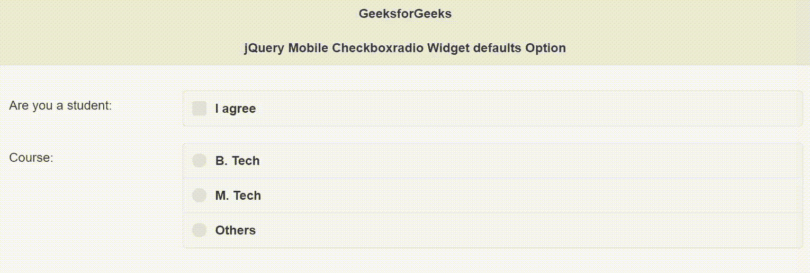

# jQuery 手机 Checkboxradio 小部件默认选项

> 原文:[https://www . geesforgeks . org/jquery-mobile-checkbox radio-widget-defaults-option/](https://www.geeksforgeeks.org/jquery-mobile-checkboxradio-widget-defaults-option/)

jQuery Mobile 是一种基于网络的技术，用于制作可在所有智能手机、平板电脑和台式机上访问的响应内容。
在本文中，我们将使用 jQuery Mobile Checkboxradio 小部件*默认值*选项设置为 *true* ，这表明其他小部件具有默认值，并导致 jQuery Mobile 的小部件自动增强代码省略从数据属性中检索选项值的步骤。接受布尔类型值，默认值为*假*。

**语法:**

```html
$( ".selector" ).checkboxradio({
    defaults: boolean
});
```

**CDN 链接:**首先，添加项目所需的 jQuery Mobile 脚本。

> <link rel="”stylesheet”" href="”//code.jquery.com/mobile/1.4.5/jquery.mobile-1.4.5.min.css”">
> <脚本 src =//code . jquery . com/jquery-1 . 10 . 2 . min . js”></脚本>
> <脚本 src =//code . jquery . com/mobile/1 . 4 . 5/jquery . mobile-1 . 4 . 5 . min . js”></脚本>

**示例:**

## 超文本标记语言

```html
<!doctype html>
<html lang="en">

<head>
    <meta charset="utf-8">
    <meta name="viewport" 
        content="width=device-width, initial-scale=1">

    <link rel="stylesheet" href=
"//code.jquery.com/mobile/1.4.5/jquery.mobile-1.4.5.min.css">

    <script src=
        "//code.jquery.com/jquery-1.10.2.min.js">
    </script>

    <script src=
"//code.jquery.com/mobile/1.4.5/jquery.mobile-1.4.5.min.js">
    </script>

    <script>
        $(document).ready(function () {
            $(".GFG, .GFG1").checkboxradio({
                defaults: true
            });
        });
    </script>
</head>

<body>
    <div data-role="page" id="page1">
        <div data-role="header">
            <h1>GeeksforGeeks</h1>
            <h3>jQuery Mobile Checkboxradio Widget defaults Option</h3>
        </div>

        <div role="main" class="ui-content">
            <div class="ui-field-contain">
                <form>
                    <fieldset data-role="controlgroup">
                        <legend>Are you a student:</legend>
                        <input type="checkbox" name="checkbox" 
                            id="checkbox" class="GFG">
                        <label for="checkbox">I agree</label>
                    </fieldset>

                    <br>
                    <fieldset data-role="controlgroup">
                        <legend>Course:</legend>
                        <input type="radio" name="radioBtn" 
                            id="radioBtn1" class="GFG1">
                        <label for="radioBtn1">B. Tech</label>

                        <input type="radio" name="radioBtn" 
                            id="radioBtn2" class="GFG1">
                        <label for="radioBtn2">M. Tech</label>

                        <input type="radio" name="radioBtn" 
                            id="radioBtn3" class="GFG1">
                        <label for="radioBtn3">Others</label>
                    </fieldset>
                </form>
            </div>
        </div>
    </div>
</body>

</html>
```

**输出:**



**参考:**[https://API . jquerymobile . com/1.4/checkbox radio/# option-defaults](https://api.jquerymobile.com/1.4/checkboxradio/#option-defaults)