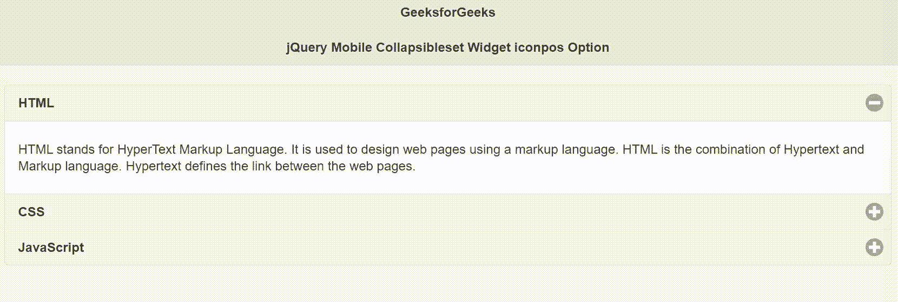

# jQuery 手机可折叠小部件图标选项

> 原文:[https://www . geesforgeks . org/jquery-mobile-collapsibleset-widget-icon pos-option/](https://www.geeksforgeeks.org/jquery-mobile-collapsibleset-widget-iconpos-option/)

jQuery Mobile 是一种基于网络的技术，用于制作可在所有智能手机、平板电脑和台式机上访问的响应内容。
在本文中，我们将使用 jQuery Mobile collapsiblete Widget*图标*选项来设置图标在可折叠标题中的位置。*图标*的可能值为*左、右、上、下、无、注下*。接受字符串类型值，默认值为“*左*”。

**语法:**

```
$( ".selector" ).collapsibleset({
    iconpos: string
});
```

**CDN 链接:**首先，添加项目所需的 jQuery Mobile 脚本。

> <link rel="”stylesheet”" href="”//code.jquery.com/mobile/1.4.5/jquery.mobile-1.4.5.min.css”">
> <脚本 src =//code . jquery . com/jquery-1 . 10 . 2 . min . js”></脚本>
> <脚本 src =//code . jquery . com/mobile/1 . 4 . 5/jquery . mobile-1 . 4 . 5 . min . js”></脚本>

**示例:**

## 超文本标记语言

```
<!doctype html>
<html lang="en">

<head>
    <meta charset="utf-8">
    <meta name="viewport" 
          content="width=device-width, initial-scale=1">

    <link rel="stylesheet" href=
"//code.jquery.com/mobile/1.4.5/jquery.mobile-1.4.5.min.css">

    <script src="//code.jquery.com/jquery-1.10.2.min.js">
    </script>

    <script src=
"//code.jquery.com/mobile/1.4.5/jquery.mobile-1.4.5.min.js">
    </script>

    <script>
        $(document).ready(function () {
            $("#GFG").collapsibleset({
                iconpos: "right"
            });
        });
    </script>
</head>

<body>
    <div data-role="page" id="page1">
        <div data-role="header">
            <h1>GeeksforGeeks</h1>
            <h3>jQuery Mobile Collapsibleset Widget iconpos Option</h3>
        </div>

        <div role="main" class="ui-content">
            <div data-role="collapsibleset" id="GFG">
                <div data-role="collapsible" data-collapsed="false">
                    <h3>HTML</h3>
                    <p>
                        HTML stands for HyperText Markup Language. 
                        It is used to design web pages using a 
                        markup language. HTML is the combination 
                        of Hypertext and Markup language. Hypertext 
                        defines the link between the web pages.
                    </p>

                </div>

                <div data-role="collapsible">
                    <h3>CSS</h3>
                    <p>
                        CSS (Cascading Style Sheets) is a stylesheet 
                        language used to design the webpage to make 
                        it attractive. The reason of using CSS is to 
                        simplify the process of making web pages 
                        presentable. CSS allows you to apply styles 
                        to web pages. More importantly, CSS enables 
                        you to do this independent of the HTML that 
                        makes up each web page.
                    </p>

                </div>

                <div data-role="collapsible">
                    <h3>JavaScript</h3>
                    <p>
                        JavaScript is the world most popular lightweight, 
                        interpreted compiled programming language. It is 
                        also known as scripting language for web pages. 
                        It is well-known for the development of web pages, 
                        many non-browser environments also use it. 
                        JavaScript can be used for Client-side developments 
                        as well as Server-side developments.
                    </p>

                </div>
            </div>
        </div>
    </div>
</body>

</html>
```

**输出:**



**参考:**[https://API . jquerymobile . com/collapsible et/# option-iconpos](https://api.jquerymobile.com/collapsibleset/#option-iconpos)