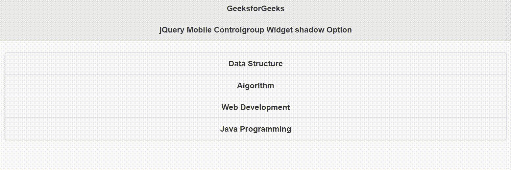

# jQuery 移动控件组小部件阴影选项

> 原文:[https://www . geesforgeks . org/jquery-mobile-control group-widget-shadow-option/](https://www.geeksforgeeks.org/jquery-mobile-controlgroup-widget-shadow-option/)

jQuery Mobile 是一种基于网络的技术，用于制作可在所有智能手机、平板电脑和台式机上访问的响应内容。
在本文中，我们将使用 jQuery 移动控制组小部件*阴影*选项设置为*真*，在控制组周围绘制阴影。接受布尔类型值，默认值为*假*。

**语法:**

```html
$( ".selector" ).controlgroup({
   shadow: boolean
});
```

**CDN 链接**:首先，添加你的项目需要的 jQuery Mobile 脚本。

> <link rel="”stylesheet”" href="”//code.jquery.com/mobile/1.4.5/jquery.mobile-1.4.5.min.css”">
> <脚本 src =//code . jquery . com/jquery-1 . 10 . 2 . min . js”></脚本>
> <脚本 src =//code . jquery . com/mobile/1 . 4 . 5/jquery . mobile-1 . 4 . 5 . min . js”></脚本>

**示例:**

## 超文本标记语言

```html
<!doctype html>
<html lang="en">

<head>
    <meta charset="utf-8">
    <meta name="viewport" 
        content="width=device-width, initial-scale=1">

    <link rel="stylesheet" href=
"//code.jquery.com/mobile/1.4.5/jquery.mobile-1.4.5.min.css">

    <script src=
        "//code.jquery.com/jquery-1.10.2.min.js">
    </script>

    <script src=
"//code.jquery.com/mobile/1.4.5/jquery.mobile-1.4.5.min.js">
    </script>

    <script>
        $(document).ready(function () {
            $("#GFG").controlgroup({
                shadow: true
            });
        });
    </script>
</head>

<body>
    <div data-role="page" id="page1">
        <div data-role="header">
            <h1>GeeksforGeeks</h1>
            <h3>jQuery Mobile Controlgroup Widget shadow Option</h3>
        </div>

        <div role="main" class="ui-content">
            <div data-role="controlgroup" id="GFG">
                <a href=
                "https://www.geeksforgeeks.org/data-structures/" 
                    class="ui-btn">
                    Data Structure
                </a>

                <a href=
        "https://www.geeksforgeeks.org/fundamentals-of-algorithms/" 
                    class="ui-btn">
                    Algorithm
                </a>

                <a href=
                "https://www.geeksforgeeks.org/web-development/" 
                    class="ui-btn">
                    Web Development
                </a>

                <a href="https://www.geeksforgeeks.org/java/" 
                    class="ui-btn">
                    Java Programming
                </a>
            </div>
        </div>
    </div>
</body>

</html>
```

**输出:**



**参考:**[https://API . jquerymobile . com/1.4/control group/# option-shadow](https://api.jquerymobile.com/1.4/controlgroup/#option-shadow)