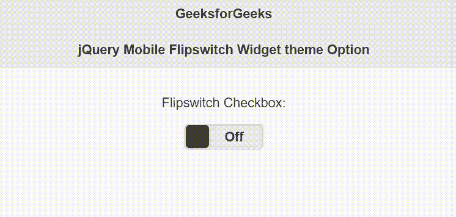

# jQuery 手机动画开关小部件主题选项

> 原文:[https://www . geesforgeks . org/jquery-mobile-flips switch-widget-theme-option/](https://www.geeksforgeeks.org/jquery-mobile-flipswitch-widget-theme-option/)

jQuery Mobile 是一种基于网络的技术，用于制作可在所有智能手机、平板电脑和台式机上访问的响应内容。
在本文中，我们将使用 jQuery Mobile Flipswitch 小部件*主题*选项来设置 flipsswitch 小部件的配色方案。它的可能值是介于“a–z”之间的字符。它接受字符串类型值，默认值为 *null* ，从父级继承。

**语法:**

```
$( ".selector" ).flipswitch({
  theme: string
});
```

**CDN 链接:**首先，添加项目所需的 jQuery Mobile 脚本。

> <link rel="”stylesheet”" href="”//code.jquery.com/mobile/1.4.5/jquery.mobile-1.4.5.min.css”">
> <脚本 src =//code . jquery . com/jquery-1 . 10 . 2 . min . js”></脚本>
> <脚本 src =//code . jquery . com/mobile/1 . 4 . 5/jquery . mobile-1 . 4 . 5 . min . js”></脚本>

**示例:**

## 超文本标记语言

```
<!doctype html>
<html lang="en">

<head>
    <meta charset="utf-8">
    <meta name="viewport" content=
        "width=device-width, initial-scale=1">

    <link rel="stylesheet" href=
"//code.jquery.com/mobile/1.4.5/jquery.mobile-1.4.5.min.css">

    <script src=
        "//code.jquery.com/jquery-1.10.2.min.js">
    </script>

    <script src=
"//code.jquery.com/mobile/1.4.5/jquery.mobile-1.4.5.min.js">
    </script>

    <script>
        $(document).ready(function () {
            $("#GFG").flipswitch({
                theme: "b"
            });
        });
    </script>
</head>

<body>
    <div data-role="page" id="page1">
        <div data-role="header">
            <h1>GeeksforGeeks</h1>
            <h3>jQuery Mobile Flipswitch Widget theme Option</h3>
        </div>

        <div class="ui-field-contain">
            <form>
                <div data-role="fieldcontain">
                    <center>
                        <label for="GFG">
                            Flipswitch Checkbox:
                        </label>
                        <input type="checkbox" id="GFG" 
                            data-role="flipswitch">
                    </center>
                </div>
            </form>
        </div>
    </div>
</body>

</html>
```

**输出:**



**参考:**T2】https://api.jquerymobile.com/flipswitch/#option-theme