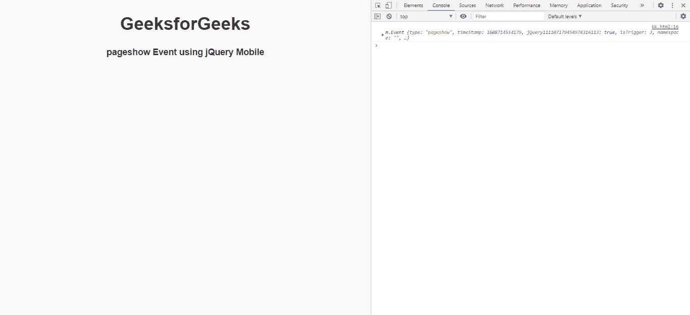
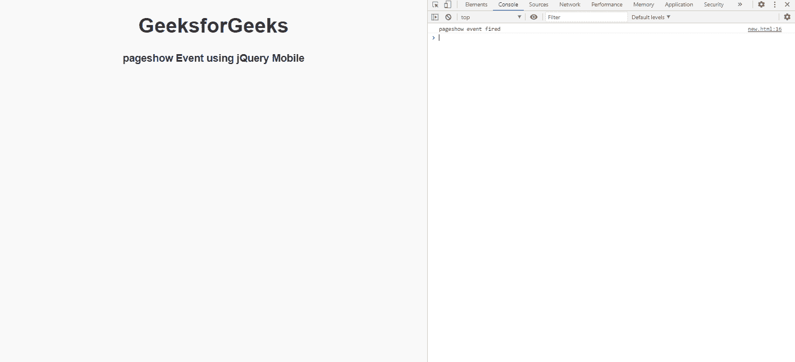

# jQuery 手机页面展示活动

> 原文:[https://www.geeksforgeeks.org/jquery-mobile-pageshow-event/](https://www.geeksforgeeks.org/jquery-mobile-pageshow-event/)

过渡动画完成后，jQuery Mobile 页面显示事件在“toPage”上触发。我们可以将这个事件用于不同的目的。

**语法:**

```html
jQuery( ".selector" ).on( "pageshow", function( event ) {  } )
```

**进场:**

*   首先，添加项目所需的 jQuery Mobile 脚本。

    ```html
    <link rel="stylesheet"
        href="http://code.jquery.com/mobile/1.4.5/jquery.mobile-1.4.5.min.css" />
    <script 
        src="http://code.jquery.com/jquery-1.11.1.min.js">
    </script>
    <script 
        src="http://code.jquery.com/mobile/1.4.5/jquery.mobile-1.4.5.min.js">
    </script>
    ```

**例 1:**

## 超文本标记语言

```html
<!DOCTYPE html>
<html>
    <head>
        <link rel="stylesheet"
              href=
"http://code.jquery.com/mobile/1.4.5/jquery.mobile-1.4.5.min.css" />
        <script src=
"http://code.jquery.com/jquery-1.11.1.min.js">
      </script>
        <script src=
"http://code.jquery.com/mobile/1.4.5/jquery.mobile-1.4.5.min.js">
      </script>

        <script type="text/javascript">
            $(document).on("pageshow", function (event) {
                console.log(event);
            });
        </script>
    </head>

    <body>
        <center>
            <h1>GeeksforGeeks</h1>
            <h4>pageshow Event using jQuery Mobile</h4>
        </center>
    </body>
</html>
```

**输出:**



**例 2:**

## 超文本标记语言

```html
<!DOCTYPE html>
<html>
    <head>
        <link rel="stylesheet"
              href=
"http://code.jquery.com/mobile/1.4.5/jquery.mobile-1.4.5.min.css" />
        <script src=
"http://code.jquery.com/jquery-1.11.1.min.js">
      </script>
        <script src=
"http://code.jquery.com/mobile/1.4.5/jquery.mobile-1.4.5.min.js">
      </script>

        <script type="text/javascript">
            $(document).on("pageshow", function () {
                console.log("pageshow event fired");
            });
        </script>
    </head>

    <body>
        <center>
            <h1>GeeksforGeeks</h1>
            <h4>pageshow Event using jQuery Mobile</h4>
        </center>
    </body>
</html>
```

**输出:**

